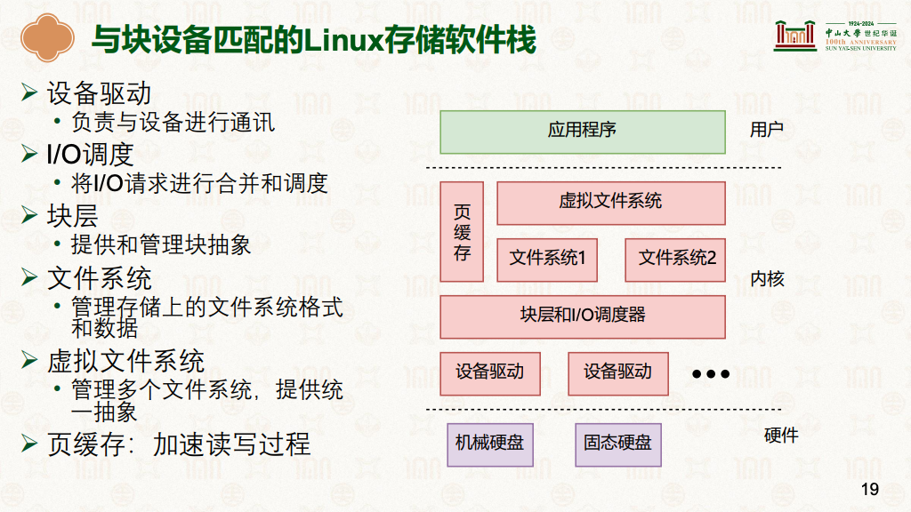
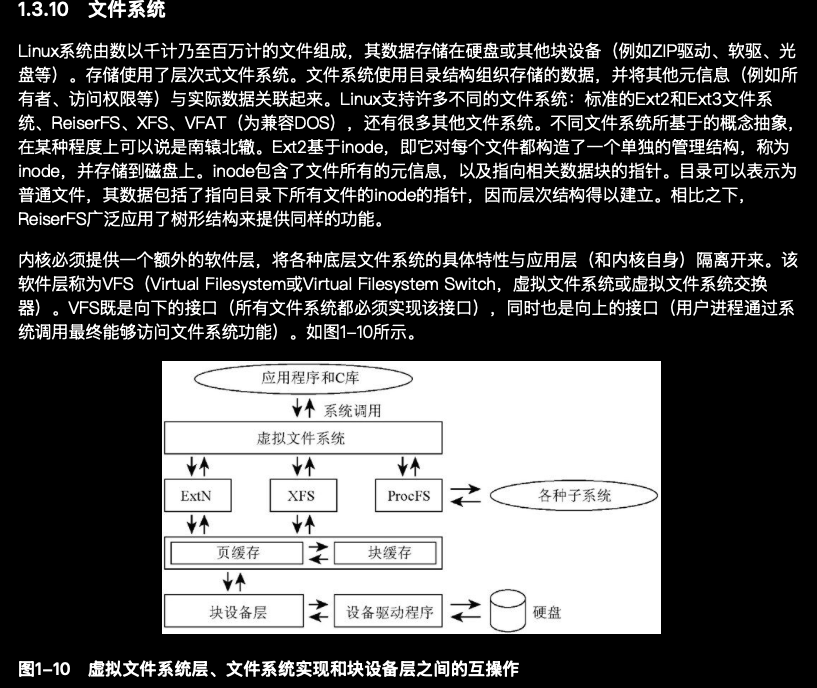
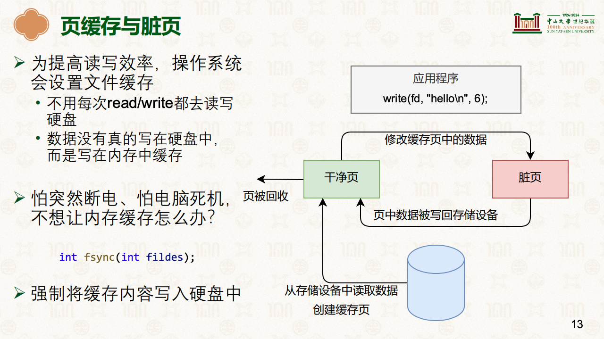

# 文件系统(File System.FS)
先学习:  <br/>[17-文件系统：基于inode的文件系统 [中山大学 操作系统原理]](../../001.UNIX-DOCS/001.操作系统课程/000.中山大学-操作系统2025/9-0424-fs.pdf) <br/> [18-文件系统：使用文件系统 [中山大学 操作系统原理]](../../001.UNIX-DOCS/001.操作系统课程/000.中山大学-操作系统2025/10-0428-fs.pdf)  <br/> [深入理解Linux内核:虚拟文件系统](../../007.BOOKs/Professional-Linux-Kernel-Architecture.epub)  <br/> [文件系统崩溃一致性](../../001.UNIX-DOCS/001.操作系统课程/000.中山大学-操作系统2025/11-0508-fs-crash-1.pdf)  <br/> [文件系统崩溃一致性II](../../001.UNIX-DOCS/001.操作系统课程/000.中山大学-操作系统2025/12-0512-fs-crash-2.pdf)

---

## 简介
Linux 文件系统是操作系统管理和存储文件的一套机制。但 Linux 的精妙之处在于，它不仅用文件系统来存照片和文档，还用它来**“管理内核状态”**。

在 Linux 中，有一句名言：“万物皆文件”（Everything is a file）。
- 常规文件系统（如 Ext4, XFS）
- 虚拟文件系统（如 procfs, sysfs, cgroupfs）：这些文件并不存在于硬盘上，而是内核在内存中虚拟出来的。当你读取这些“文件”时，你其实是在读取内核的状态；当你修改这些“文件”时，你其实是在直接调整内核的参数。

---

## 概念整理
|概念|说明|备注|参考|
|-|-|-|-|
|- 块设备|- 一次性读取多位数据，即“块”  <br/> - “数据总是以固定长度的块进行传输。即使只请求一个字节的数据，设备驱动程序也会从设备取出一个完全块的数据。” <br/>- "块"是一个特定长度的字节序列，用于保存在内核和设备之间传输的数据” <br/>- 对块设备的访问有大规模的缓存，即已经读取的数据保存在内存中。如果再次需要，则直接从内存获得。**写入操作也使用了缓存，以便延迟处理**。<br/>- “对块设备的读写请求不会立即执行对应的操作。相反，这些请求会汇总起来，经过协同之后传输到设备。<sup>(请求队列)</sup>”|- “块的长度可通过软件方法修改”，但 “块的最大长度，会受到特定体系结构的内存页长度的限制”|- [17-文件系统：基于inode的文件系统 [中山大学 操作系统原理]#P17](../../001.UNIX-DOCS/001.操作系统课程/000.中山大学-操作系统2025/9-0424-fs.pdf) <br/>- [深入Linux架构#“6.5　块设备操作”](../../007.BOOKs/Professional-Linux-Kernel-Architecture.epub)|
|-|-|-|-|
|- Linux存储软件技术栈|-  <br/> - |- 应用程序从上往下调用 <br/> 不同文件系统，操作函数不一样，见: [000.LINUX-5.9/include/linux/fs.h]#struct file_operations|- [17-文件系统：基于inode的文件系统 [中山大学 操作系统原理]#P19](../../001.UNIX-DOCS/001.操作系统课程/000.中山大学-操作系统2025/9-0424-fs.pdf) <br/>-  [深入理解Linux内核:1.3.10 文件系统](../../007.BOOKs/Professional-Linux-Kernel-Architecture.epub)|
|-|-|-|-|
|- 页缓存与脏页 <sup>读写都有缓存!</sup>|- |- 为提高读写效率，操作系统会设置文件缓存:<br/>&nbsp;&nbsp;&nbsp;&nbsp;- 不用每次read/write都去读写硬盘:<br/>&nbsp;&nbsp;&nbsp;&nbsp;- 数据没有真的写在硬盘中，而是写在内存中缓存 <br/><br/>- 对块设备的访问有大规模的缓存，即已经读取的数据保存在内存中。如果再次需要，则直接从内存获得。**写入操作也使用了缓存，以便延迟处理** <br/>- “对块设备的读写请求不会立即执行对应的操作。相反，这些请求会汇总起来，经过协同之后传输到设备。<sup>(请求队列)</sup>”|- [17-文件系统：基于inode的文件系统 [中山大学 操作系统原理]#P13](../../001.UNIX-DOCS/001.操作系统课程/000.中山大学-操作系统2025/9-0424-fs.pdf) <br/>- [深入Linux架构#“6.5　块设备操作”](../../007.BOOKs/Professional-Linux-Kernel-Architecture.epub)|
|-|-|-|-|
|-|-|-|-|
|-|-|-|-|
|-|-|-|-|

## 文件系统实现
|细节|说明|参考|
|-|-|-|
|-|-|-|
|-|-|-|
|-|-|-|
|-|-|-|

---

## 命令摘要
|命令|说明|备注|
|-|-|-|
|- sudo fsck -t ext4 /dev/sdb2 |-|- 文件系统恢复|
|-|-|-|
|-|-|-|

---

## 内核源码标记
|描述|说明|参考|
|-|-|-|
|- 块设备|- [struct block_device :“ 对设备驱动程序层表示一个块设备”](../../000.SOURCE_CODE/000.LINUX-5.9/000.LINUX-5.9/include/linux/blk_types.h)|-|
|-|-|-|
|-|-|-|
|-|-|-|


---

## 查看文件的文件系统类型
```bash
# 1. df -T <文件路径>
wei@Berries:~/VirtualBox_VMs$ df -T /sys/fs/cgroup/
Filesystem     Type    1K-blocks  Used Available Use% Mounted on
cgroup2        cgroup2         0     0         0    - /sys/fs/cgroup


# 2. state -f <文件路径>
wei@Berries:~/VirtualBox_VMs$ stat -f /sys/fs/cgroup/
  File: "/sys/fs/cgroup/"
    ID: 218518cfb40c0f19 Namelen: 255     Type: cgroup2fs
Block size: 4096       Fundamental block size: 4096
Blocks: Total: 0          Free: 0          Available: 0
Inodes: Total: 0          Free: 0

```