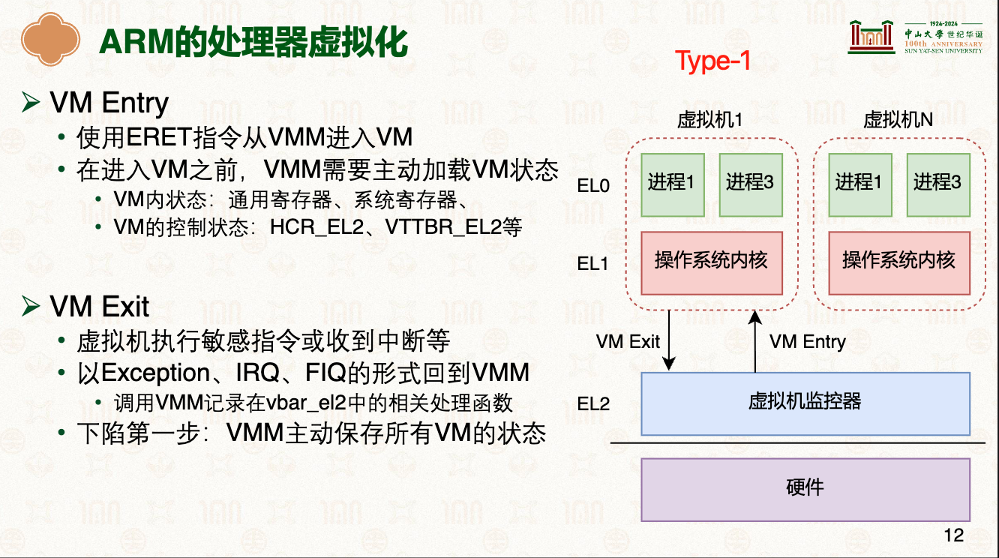
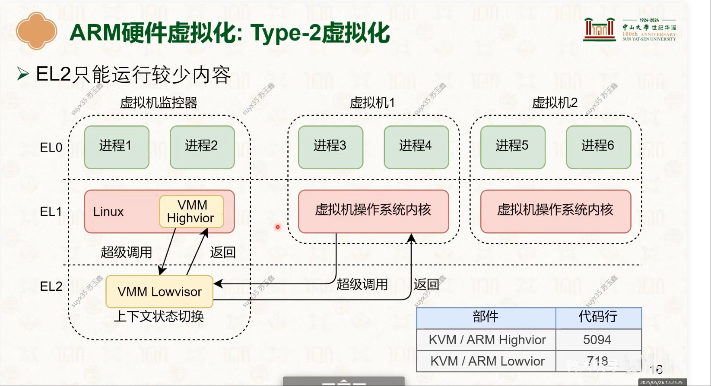
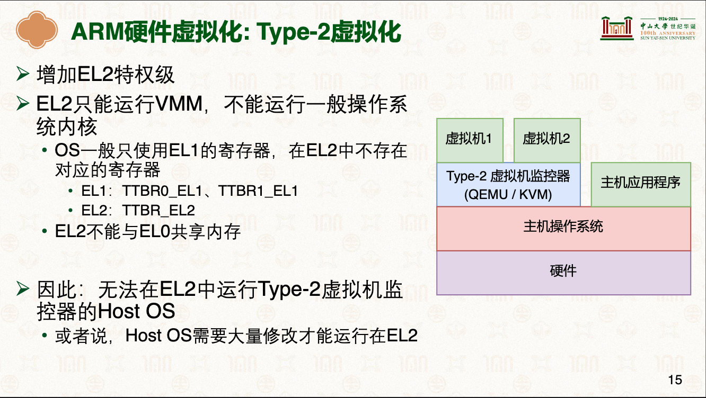
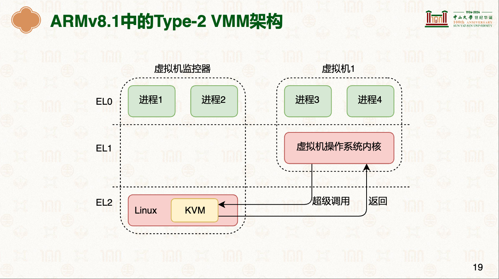
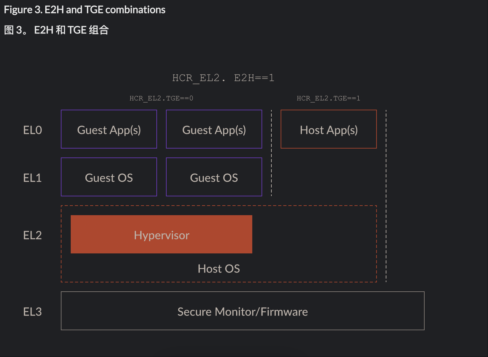

# CPU虚拟化
> 学习: [23-虚拟化：CPU虚拟化 [中山大学 操作系统原理]#方法4：硬件虚拟化#P11](../../000.内存管理/998.REFS/000.中山大学-操作系统/14-0526-virt-2.pdf)

## CPU虚拟化实现方式： 方法4：硬件虚拟化
x86_64和ARM都引入了全新的虚拟化特权级

|平台|虚拟化方式|着重阅读资料|
|-|-|-|
|x86_64|- Intel推出了VT-x硬件虚拟化扩展   - amd: AMD-V|-|
|-|-|-|
|ARM|- ARM引入了EL2 |- [23-虚拟化：CPU虚拟化 [中山大学 操作系统原理]#方法4：硬件虚拟化#P11](../../000.内存管理/998.REFS/000.中山大学-操作系统/14-0526-virt-2.pdf)   - [Learn the architecture - AArch64 virtualization](../../../006.REFS/learn_the_architecture_aarch64_virtualization_guide_102142_0100_06_en.pdf)|

## 注意事项
### 不同虚拟机内的进程如何切换?

---

### KVM 流程(EL1<->EL2)
学习 [Virtualization host extensions](../../../006.REFS/learn_the_architecture_aarch64_virtualization_guide_102142_0100_06_en.pdf)

#### 未开启VHE + TGE
- 
   + 为什么有VMM Highvior + VMM Lowvisor? 
     - 

#### 开启VHE + TGE
操作系统内核寄存器能在虚拟机监控器模块下和普通的模块下能自动映射不同异常级别的寄存器，做了自动映射后的架构示意图: 
-  变成了Type-1

- 

- 
---

## 参考资料
- [Learn the architecture - AArch64 virtualization](https://developer.arm.com/documentation/102142/0100/Stage-2-translation)
- [Learn the architecture - AArch64 virtualization](../../../006.REFS/learn_the_architecture_aarch64_virtualization_guide_102142_0100_06_en.pdf)
- [HVC (A64)](https://developer.arm.com/documentation/dui0801/l/A64-General-Instructions/HVC--A64-?lang=en)
- [Learn the architecture - AArch64 Exception Model](../../../006.REFS/learn_the_architecture_-_aarch64_exception_model_102412_0103_02_en.pdf)Synchronous exceptions are routed according to the rules associated with the exception-generating instructions SVC, HVC, and SMC. When implemented, other classes of exception can be routed to EL2 (Hypervisor) or EL3 (Secure Monitor). Routing is set independently for IRQs, FIQs, and SErrors. 