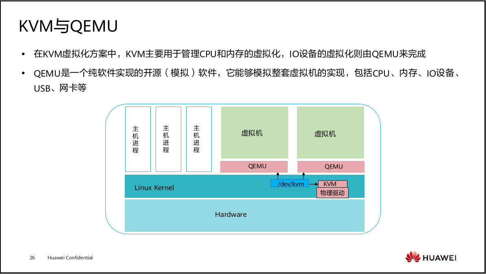
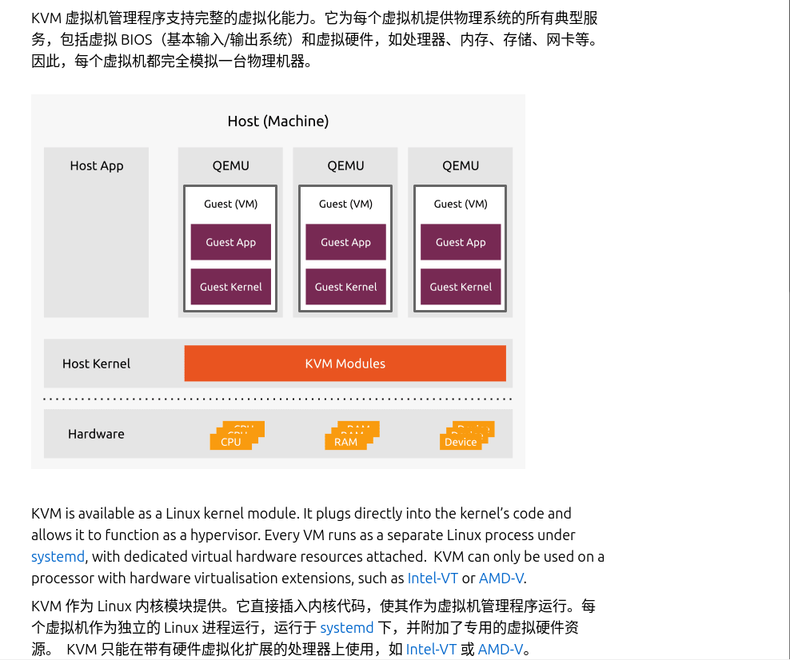

# KVM（Kernel-based Virtual Machine） 核心: 将底层的物理服务器转变为虚拟机管理程序（Hypervisor）
> 原理: [001.UNIX-DOCS/035.系统虚拟化/000.REF-DOCS/HCIA-Cloud Computing V5.5 培训教材.pdf](./../../../../001.UNIX-DOCS/035.系统虚拟化/000.REF-DOCS/HCIA-Cloud%20Computing%20V5.5%20培训教材.pdf)#'虚拟化技术概览'
## 摘要
- KVM + QEMU 实现Type-1 虚拟化
  + KVM (Kernel-based Virtual Machine) is the leading open source virtualisation technology for Linux. It installs natively on all Linux distributions and turns underlying physical servers into hypervisors so that they can host multiple, isolated virtual machines (VMs).  (能在所有 Linux 发行版上原生安装，并**将底层的物理服务器转变为虚拟机管理程序**核心: 将底层的物理服务器转变为虚拟机管理程序（Hypervisor），以便它们可以托管多个隔离的虚拟机（VM）)

## KVM 、QEMU在虚拟化中的角色
-  in [001.UNIX-DOCS/035.系统虚拟化/000.REF-DOCS/HCIA-Cloud Computing V5.5 培训教材.pdf](./../../../../001.UNIX-DOCS/035.系统虚拟化/000.REF-DOCS/HCIA-Cloud%20Computing%20V5.5%20培训教材.pdf)
   + QEMU离不开KVM。之前我们提到，QEMU是一个纯软件的实现，运行在用户空间，性能非常低下，所以从QEMU的角度可以说是QEMU使用了KVM的虚拟化功能，为自身虚拟机提供资源与加速
   + Note: QEMU is the hardware emulator in the libvirt virtualization stack. No virtualization technology works purely on hardware-assisted virtualization, which provides virtual CPUs, virtual memory, and maybe virtual device buses. All hypervisors need some degree of hardware emulation to provide virtual video, disk, network, keyboard, and other kinds of devices. KVM provides only hardware-assisted virtualization, and QEMU provides everything else. It’s interesting to note that more of libvirt’s capabilities relate to QEMU than to KVM.(注意：QEMU 是 libvirt 虚拟化栈中的硬件仿真器。没有任何虚拟化技术纯依赖硬件辅助虚拟化，后者提供虚拟 CPU、虚拟内存，甚至虚拟设备总线。所有虚拟机监控程序都需要一定程度的硬件仿真，以提供虚拟视频、磁盘、网络、键盘及其他类型的设备。KVM 只提供硬件辅助虚拟化，QEMU 则提供其他所有功能。有趣的是，libvirt 更多功能与 QEMU 相关，而非 KVM。)in [Rootless virtual machines with KVM and QEMU](./999.REFS/Rootless%20virtual%20machines%20with%20KVM%20and%20QEMU.png) -- [Rootless virtual machines with KVM and QEMU](https://developers.redhat.com/articles/2024/12/18/rootless-virtual-machines-kvm-and-qemu#)

## 介绍
|KVM介绍|来源|说明|
|-|-|-|
|Kernel-based Virtual Machine (KVM) is an open source virtualization technology for Linux® operating systems. With KVM, Linux can function as a hypervisor that runs multiple, isolated virtual machines (VMs).(基于内核的虚拟机（Kernel-based Virtual Machine，简称 KVM）是一种用于 Linux® 操作系统的开源虚拟化技术。通过 KVM，Linux 可以作为一个虚拟机管理程序（Hypervisor）运行，从而运行多个相互隔离的虚拟机（VM）)|- [RedHat:What is KVM? ](https://www.redhat.com/en/topics/virtualization/what-is-KVM)   - [RedHat:What is KVM? ](./999.REFS/RedHat-What%20is%20KVM.png)local|-|
|-|-|-|
|基于内核的虚拟机（KVM）可以将任何 Linux 设备转变为裸机虚拟机监控器。|- [什么是 KVM（基于内核的虚拟机）？:AWS](https://aws.amazon.com/what-is/kvm/)   - [什么是 KVM（基于内核的虚拟机）？:AWS](./999.REFS/基于内核的虚拟机简介%20–%20AWS.png)local|- Bare Metal Server裸金属服务器:“裸金属”意味着这台服务器上没有预装任何虚拟化层（Hypervisor）或操作系统，用户拥有对底层硬件（CPU、内存、硬盘）的完整物理访问权限  |
|-|-|-|
|KVM (Kernel-based Virtual Machine) is the leading open source virtualisation technology for Linux. It installs natively on all Linux distributions and **turns underlying physical servers into hypervisors** so that they can host multiple, isolated virtual machines (VMs). KVM（基于内核的虚拟机）是 Linux 平台上领先的开源虚拟化技术。它可以在所有 Linux 发行版上进行原生安装，并**将底层的物理服务器转变为虚拟机管理程序（Hypervisor）**，使其能够承载多个相互隔离的虚拟机（VM）。KVM comes with no licenses, type-1 hypervisor capabilities and a variety of performance extensions which makes it an ideal candidate for virtualisation and cloud infrastructure implementation. But what are the benefits of KVM hypervisor and how do you get started?KVM 无需授权费用，具备 Type-1（裸机型）虚拟机管理程序的能力，并提供多种性能扩展插件，这使其成为虚拟化和云基础设施实施的理想选择。但是，KVM 虚拟机管理程序究竟有哪些优势？你又该如何开始使用它呢？</sup|- [KVM hypervisor: a beginners’ guide](https://ubuntu.com/blog/kvm-hyphervisor)   - [KVM hypervisor: a beginners’ guide](./999.REFS/ubuntu-KVM-hypervisor-a-beginners-guide.png)local|- |

---
## 注意事项
|注意事项|说明|来源|思考|
|-|-|-|-|
|I/O虚拟化-客户机可使用设备分类|- 在QEMU/KVM中，客户机可以使用的设备大致可分为三类（即 虚拟化方式）:  - 模拟设备：完全由QEMU纯软件模拟的设备  - Virtio设备：实现VIRTIO API的半虚拟化设备  - PCI设备直接分配(PCI device assignment)  不同虚拟化方式，性能不一，使用场景一也就不一样|[001.UNIX-DOCS/035.系统虚拟化/000.REF-DOCS/HCIA-Cloud Computing V5.5 培训教材.pdf](./../../../../001.UNIX-DOCS/035.系统虚拟化/000.REF-DOCS/HCIA-Cloud%20Computing%20V5.5%20培训教材.pdf)|1. 在某些场景下(游戏/渲染/其他)，需要将显卡分配给某个虚拟机,采用那种虚拟化方式呢?  - GPU 直通 (PCI Passthrough / VFIO)  - vGPU (NVIDIA vGPU / Intel GVT-g)  - 虚拟显卡 (VirtIO-GPU / QXL)    不同虚拟化方式，性能不一，使用场景一也就不一样 , 操作时再详细学习吧!!!|
|-|-|-|-|

---

## KVM管理工具
### [virt-manager](https://virt-manager.org/)
- 
