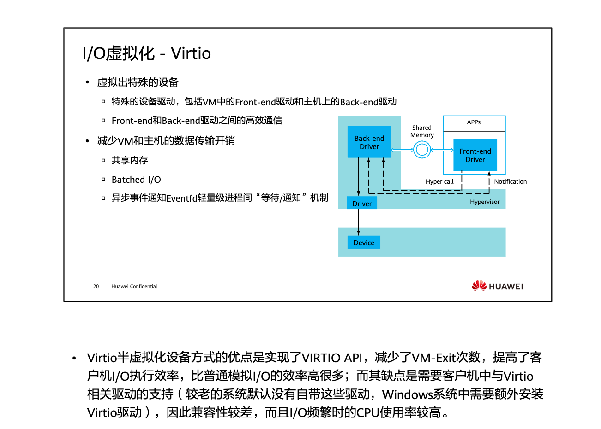
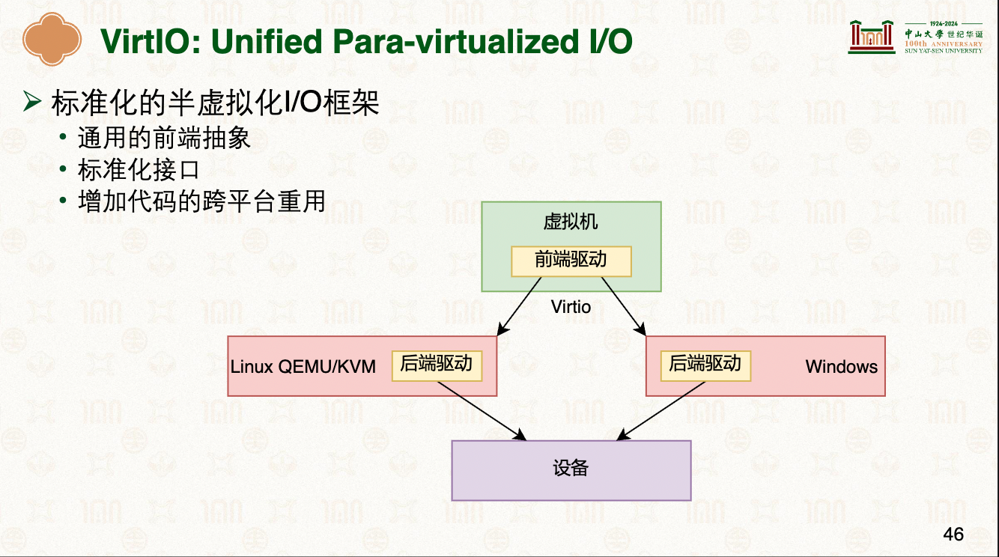
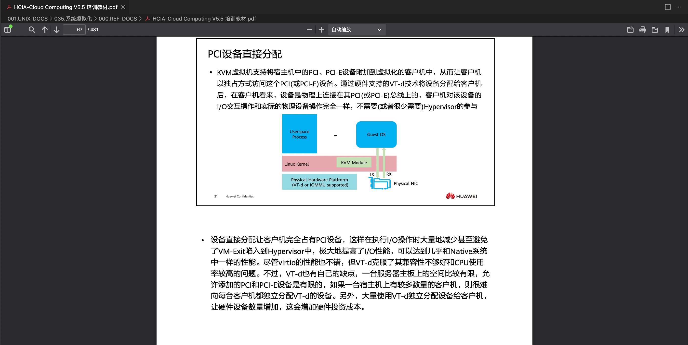

# I/O虚拟化
一定得先学习:   · [24-虚拟化：内存、设备虚拟化 [中山大学 操作系统原理]：怎么实现I/O虚拟化?](../../000.内存管理/998.REFS/000.中山大学-操作系统/14-0526-virt-2.pdf)   · <a href="./000.REF-DOCS/HCIA-Cloud Computing V5.5 培训教材.pdf">HCIA-Cloud Computing V5.5 培训教材.pdf#'虚拟化技术概览'#I/O虚拟化</a>

## I/O虚拟化方式
|虚拟化方式|说明|备注|
|-|-|-|
|设备模拟|- 用软件完全模拟一个特定的设备|-|
|-|-|-|
|半虚拟化方式（Para-virtualization）|- 虚拟机知道自己运行在虚拟化环境：驱动分为前端驱动（运行在虚拟机内） 和 后端驱动（运行在虚拟机监控器中）|-    - |
|-|-|-|
|设备直通|- 将宿主机中的PCI、PCI-E设备附加到虚拟化的客户机中，从而让客户机以独占方式访问这个PCI(或PCI-E)设备|- |

---

## 参考资料
- [Virtio: An I/O virtualization framework for Linux](https://developer.ibm.com/articles/l-virtio/)