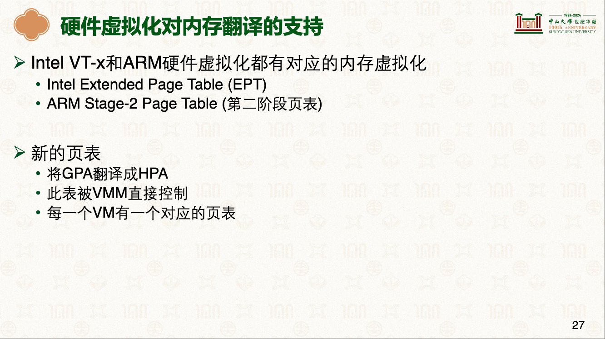
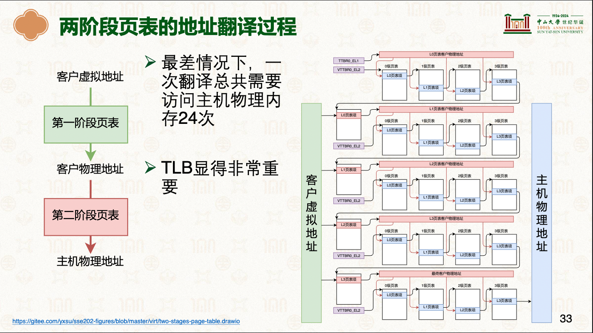
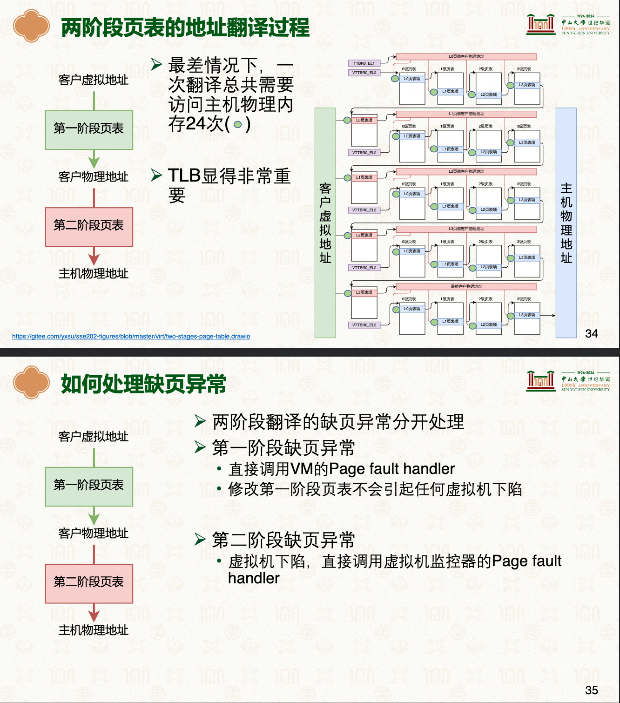

# 内存虚拟化
## 内存虚拟化目标
|内存虚拟化目标|说明|备注|
|-|-|-|
|为虚拟机提供虚拟的物理地址空间|- 物理地址从0开始连续增长|-|
|-|-|-|
|隔离不同虚拟机的物理地址空间|- VM-1无法访问其他的内存|-|

---

## 实现方式: 硬件虚拟化
- 
- 
   + 因为虚拟机操作系统中的页表也需要翻译为真实物理地址才能继续页表的翻译
- 

---

## 参考资料
- [Learn the architecture - AArch64 virtualization](https://developer.arm.com/documentation/102142/0100/Stage-2-translation)
- [Learn the architecture - AArch64 virtualization](../../../006.REFS/learn_the_architecture_aarch64_virtualization_guide_102142_0100_06_en.pdf)