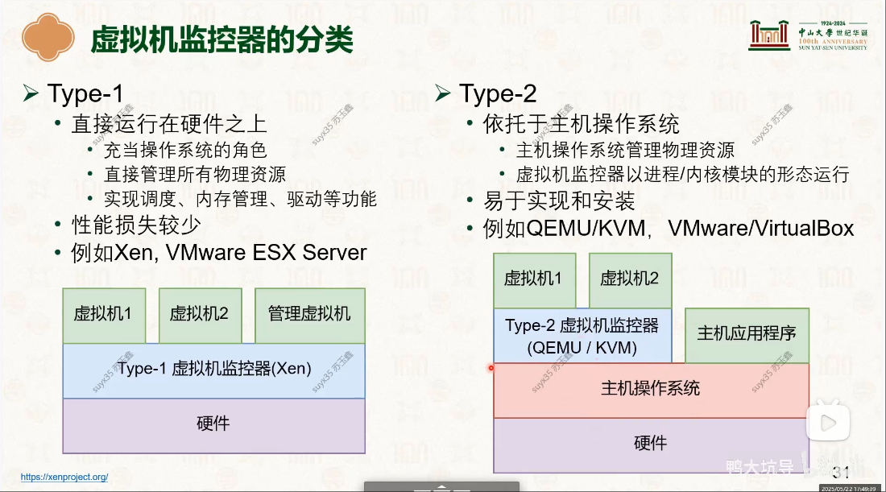

# 系统虚拟化

## 虚拟化核心 - 虚拟机监控器（Virtual Machine Monitor VMM,Hypervisor）
- 向上层虚拟机暴露其所需要的ISA（Instruction Set Architecture）
- 可同时运行多台虚拟机(VM)

### 虚拟机监控器分类
<table>
<th>虚拟化类型</th><th>说明</th><th>参考</th>
<tr><td>Type-1</td><td>直接运行在硬件之上</td><td rowspan="3"></td></tr>
<tr><td> </td><td></td></tr>
<tr><td>Type-2</td><td>虚拟机当做物理机操作系统的一个进程</td></tr>
</table>

### 如何实现系统虚拟化
> 关键点(难点)： 如何管理好系统ISA

---

## 参考资料
- [23-虚拟化：CPU虚拟化 [中山大学 操作系统原理]](./000.REF-DOCS/13-0522-virt-1.pdf)
- [24-虚拟化：内存、设备虚拟化 [中山大学 操作系统原理]](./000.REF-DOCS/14-0526-virt-2.pdf)
