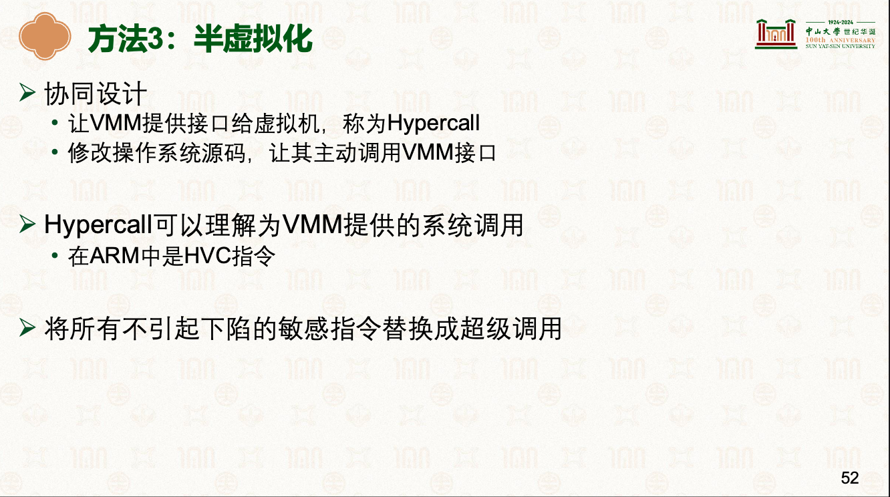
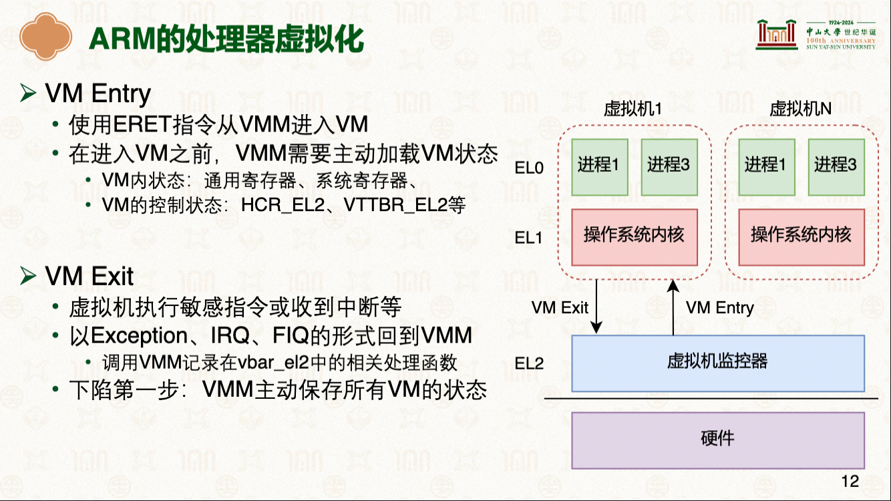

# 系统虚拟化
|重要的概念|说明|备注|
|-|-|-|
|池化|资源抽象为共享资源池  - CPU： 计算资源  - 硬盘： 存储资源|-|
|-|-|-|
|解耦|解除物理硬件和操作系统之间的紧耦合关系,操作系统所需资源从资源池中分配|- 在硬件和虚拟机之间加一层: 虚拟机监控器(VMM: Virtual Machine Monitor 、Hypeisor)： - 向上层虚拟机暴露其所需要的ISAISA: Instruction Set Architecture   - 可同时运行多台虚拟机|
|-|-|-|
|VM是文件|虚拟机(VM)对于硬件来说，就是一个文件，迁移的时候，只需要将这个"文件"迁移到另一台物理服务器上(虚拟机热迁移场景)，而无需修改|- 整台虚拟机的执行环境封装在独立文件中，可以通过移动文件的方式来迁移该虚拟机 in [001.UNIX-DOCS/035.系统虚拟化/000.REF-DOCS/HCIA-Cloud Computing V5.5 培训教材.pdf](./../../001.UNIX-DOCS/035.系统虚拟化/000.REF-DOCS/HCIA-Cloud%20Computing%20V5.5%20培训教材.pdf)|
|-|-|-|

---

## 系统虚拟化的流程 (虚拟机监控器行为)
> 指令最终还是运行在物理硬件上

|步骤|说明|备注|
|-|-|-|
|步骤1|- 捕捉所有系统ISA并下陷(Trap) & 返回|- CPU 虚拟化:   -    - |
|-|-|-|
|步骤2|- 由具体指令实现相应虚拟化:  - 控制虚拟处理器行为:[CPU虚拟化](./000.CPU虚拟化/README.md)  - 控制虚拟内存行为[内存虚拟化](./003.内存虚拟化/README.md)  - 控制虚拟设备行为:[002.IO(设备)虚拟化](./002.IO(设备)虚拟化/README.md)|-|
|-|-|-|
|步骤3|- 回到虚拟机继续执行|-|

### HVC 和 ERET 指令区别

| 指令 | 全称 | 作用 | 转换方向 |备注|
| --- | --- | --- | --- | --- |
| **HVC** Hypervisor call to allow OS code to call the Hypervisor. It generates an exception targeting exception level 2 (EL2).(虚拟机监控程序调用，允许作系统代码调用虚拟机管理程序。它生成一个针对异常等级 2（EL2）的异常。) | Hypervisor Call | **发起请求**：从 Non-secure EL1（内核态）调用 EL2（虚拟化层）。 | 向上切换 (Low -> High) |- CPU虚拟化方式之一：`方法3：半虚拟化`[23-虚拟化：CPU虚拟化 [中山大学 操作系统原理]](../000.内存管理/998.REFS/000.中山大学-操作系统/13-0522-virt-1.pdf) 的核心|
| **ERET** | Exception Return | **异常返回**：从当前异常级别返回到发生异常之前的级别。 | 向下切换 (High -> Low) ||

---

## 虚拟化核心 - 虚拟机监控器（Virtual Machine Monitor VMM,Hypervisor）
- 向上层虚拟机暴露其所需要的ISA（Instruction Set Architecture）
- 可同时运行多台虚拟机(VM)

### 虚拟机监控器分类
<table>
<th>虚拟化类型</th><th>说明</th><th>虚拟化技术</th><th>参考</th>
<tr><td>Type-1</td><td>直接运行在硬件之上( 又称:  - 本机或裸机虚拟机监控程序  - 裸金属 Hypervisor:此类 Hypervisor 直接在主机的物理硬件上运行。凭借卓越的性能与效率，此类 Hypervisor 广泛应用于企业级数据中心。例如，Google Cloud 采用基于 KVM 的 Hypervisor 作为核心引擎，为 Compute Engine 虚拟机提供强力支撑)</td><td>- VMware ESXi (vSphere): 商业化最成熟，功能最全，企业级私有云的首选。  - KVM (Kernel-based Virtual Machine)：Linux 内核的一部分。目前的公有云（亚马逊 AWS、阿里云、腾讯云）底层几乎全是 KVM 的变体,参考:<a href="./998.IMGS/RedHat一文看懂 KVM 是什么？KVM 虚拟化技术详解.png">什么是 KVM？-RedHat</a> & <a href="./000.REF-DOCS/HCIA-Cloud Computing V5.5 培训教材.pdf">HCIA-Cloud Computing V5.5 培训教材.pdf#'虚拟化技术概览'</a>（KVM： 将Linux宿主机转变为一个hypervisor） - Microsoft Hyper-V：Windows Server 自带，与 Windows 生态集成度极高。 - Xen：以安全隔离性著称，虽然在通用云市场被 KVM 赶超，但在安全系统（如 Qubes OS）和某些嵌入式场景仍在使用 </td><td rowspan="3"></td></tr>
<tr><td> </td><td></td><td></td></tr>
<tr><td>Type-2</td><td>虚拟机当做物理机操作系统的一个进程,又称:  - 托管式 Hypervisor：此类 Hypervisor 以应用形式运行在现有操作系统之上，更适用于桌面环境。此类 Hypervisor 主要应用于开发与测试场景</td><td>- Oracle VirtualBox：开源免费，跨平台支持好   -  VMware Workstation / Player：Windows/Linux 用户常用的桌面虚拟化</td></tr>
</table>

---

## 参考资料
- [23-虚拟化：CPU虚拟化 [中山大学 操作系统原理]](./000.REF-DOCS/13-0522-virt-1.pdf)
- [24-虚拟化：内存、设备虚拟化 [中山大学 操作系统原理]](./000.REF-DOCS/14-0526-virt-2.pdf)
- [什么是虚拟化？ IBM](998.IMGS/virtualization-IBM.png)
- [Ubuntu  KVM/Installation](./998.IMGS/Ubuntu_KVM_Installation-Wiki.png)
- [什么是 KVM？-RedHat](https://www.redhat.com/zh-cn/topics/virtualization/what-is-KVM)
- [KVM介绍](./000.REF-DOCS/HCIA-Cloud%20Computing%20V5.5%20培训教材.pdf) #'KVM虚拟化简介'章节
- [HVC (A64)](https://developer.arm.com/documentation/dui0801/l/A64-General-Instructions/HVC--A64-?lang=en)
- [Learn the architecture - AArch64 virtualization](https://developer.arm.com/documentation/102142/0100/Stage-2-translation)
- [Learn the architecture - AArch64 virtualization](../../../006.REFS/learn_the_architecture_aarch64_virtualization_guide_102142_0100_06_en.pdf)