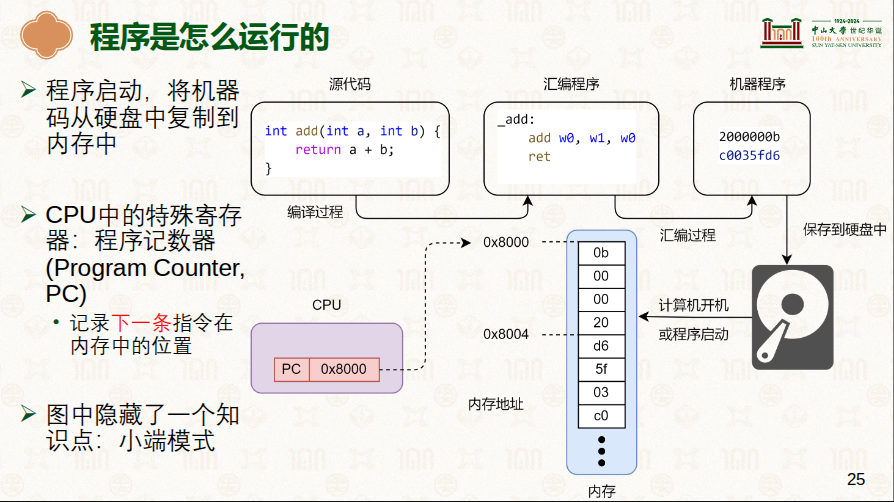

# 程序是怎么运行起来的
> 学习: - [硬件环境与软件抽象：ARM指令集架构:P25](../../../001.UNIX-DOCS/000.内存管理/998.REFS/000.中山大学-操作系统/2-0303-hardware-isa.pdf)   - [Learn the architecture - AArch64 memory management Guide
](../../../006.REFS/learn_the_architecture_aarch64_memory_management_guide_101811_0105_00_en.pdf)

## 尝试理解这句话
At Arm, we use the address 0x8000 in many of our examples. 0x8000 is also the default address for linking with the Arm linker, armlink. The address comes from an early microcomputer, the BBC Micro Model B, which had ROM (and sideways RAM) at the address 0x8000. The BBC Micro Model B was built by a company called Acorn, which developed the Acorn RISC Machine (ARM), and later became Arm. from [Learn the architecture - AArch64 memory management Guide
](../../../006.REFS/learn_the_architecture_aarch64_memory_management_guide_101811_0105_00_en.pdf)
- 与armlinker缺省约定是这个，但是实际上不是，例如 STM32F103C8T6 的默认地址是 0x08000000. 0x8000 是一个历史遗留问题。

### 它是做什么的？
在编写代码并进行“链接”（Linking）阶段时，编译器需要知道程序将来运行在内存的哪个具体位置。`所有的函数跳转、变量访问都需要基于一个基地址来计算绝对地址`。
- 默认行为： 如果你不手动指定地址，Arm 专用链接器（armlink）会默认把程序的入口点设在 0x8000。
- 作用： 它告诉处理器：“你的第一条指令（或者是向量表）就在这里，去这里找它。”

## 0x8000 是什么? 功能是这个，但是实际值不是

所有CPU在设计的时候，PC寄存器的初始值都是0x8000,即 CPU上电后，PC寄存器的值就是0x8000. 这时CPU就会从0x8000这个地址开始执行指令.
-  意思是，PC寄存器会有默认值，程序需要加载到指定位置，程序才能运行起来. 0x8000就是这个指定位置. 当然，也不一定是 0x8000 , 现在都不是了 

