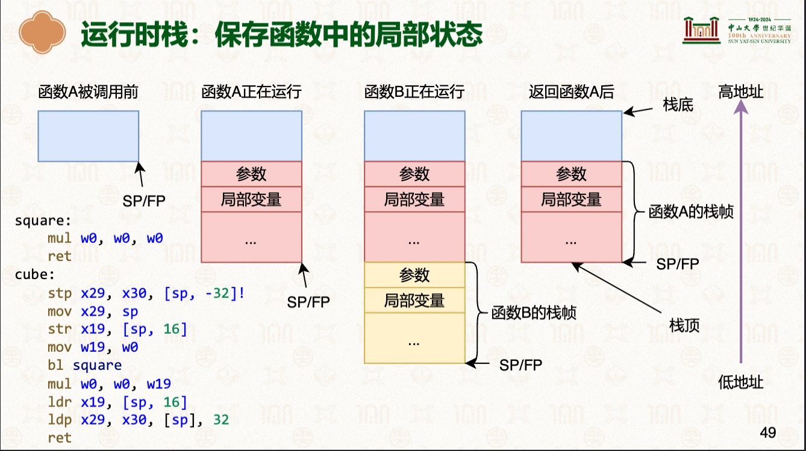

# 函数的调用、返回与栈
> 学习: <br/> - [硬件环境与软件抽象：ARM指令集架构 # >=P45](../../../001.UNIX-DOCS/000.内存管理/998.REFS/000.中山大学-操作系统/2-0303-hardware-isa.pdf) <br/> - [Arm® Architecture Reference Manualfor A-profile architecture](../../../007.BOOKs/Arm%20Architecture%20Reference%20Manual%20for%20A-profile%20architecture/)


## 着重学习内容
|知识点|说明|备注|
|-|-|-|
|- x30寄存器（别名：LR(Link Register)）|- 返回地址寄存器|-|
|-|-|-|
|- sp（Stack Pointer）存在（栈寄存器（Stack Register） 中）|- `指向当前栈帧的顶部` <br/> - 动态变化。每次执行PUSH、POP、CALL、RET指令时，SP的值都会自动增减，始终指向栈顶：|- 例如： - [SP_EL1](https://developer.arm.com/documentation/ddi0601/2025-12/AArch64-Registers/SP-EL1--Stack-Pointer--EL1-?lang=en) <br/> - 得参考芯片手册: [Arm® Architecture Reference Manualfor A-profile architecture](../../../007.BOOKs/Arm%20Architecture%20Reference%20Manual%20for%20A-profile%20architecture/) <br/>|
|-|-|-|
|- 栈帧|- 每个函数拥有的连续内存空间称为函数的栈帧（Stack Frame）|- 函数在调用时，会先压栈 —— 创建栈帧|
|-|-|-|
|- FP (Frame Pointer) 即 x29|- 栈帧在内存中的起始位置称为帧指针(Frame Pointer, FP) <br/> - `指向栈帧起始位置` |- 存于x29 通用寄存器|
|-|-|-|
|- 运行时栈：保存函数中的局部状态|- |- 函数调用返回后，栈帧会被释放 <br/>|
|-|-|-|
|- 寻址方式(汇编指令)|- 基址寻址方式(Base register addressing) : `LDR    W0,    [X1]` <br/> - 变址寻址方式(offset addressing) : `LDR    W0,    [X1， #12]`<br/> - 前变址寻址方式(pre-index addressing)：X1先更新再寻址: `LDR    W0,    [X1， #12]!` <br/> - 后变址寻址方式(post-index addressing)：X1先寻址再更新: `LDR    W0,    [X1]， #12`|- [硬件环境与软件抽象：ARM指令集架构 # >=P39](../../../001.UNIX-DOCS/000.内存管理/998.REFS/000.中山大学-操作系统/2-0303-hardware-isa.pdf)|
|-|-|-|

---

## 测试代码&分析 <sup>栈内存的申请&释放就藏在这些汇编代码之中</sup>
通过一下代码以及对应的汇编代码，理解函数的调用、返回与栈

```c
/**
 * gcc: arm-gnu-toolchain-14.3.rel1-darwin-arm64-aarch64-none-elf/bin/aarch64-none-elf-gcc -S 013.fun_call_ret_stack.c
 */  

__attribute__((noinline, noclone))
int square(int n) { return n * n; }

__attribute__((noinline, noclone))
int cube(int n) { return n * square(n); }

```
-> 对应汇编代码: 

-> -> 结合图:  <br/> -  分析
```arm
	.arch armv8-a
	.file	"013.fun_call_ret_stack.c"
	.text
	.align	2
	.global	square
	.type	square, %function
square:        
	sub	sp, sp, #16
	str	w0, [sp, 12]
	ldr	w0, [sp, 12]
	mul	w0, w0, w0
	add	sp, sp, 16
	ret
	.size	square, .-square
	.align	2
	.global	cube
	.type	cube, %function
cube:    ; 对应上图中的函数B         
    ; 为什么是 -32 :  [006.REFS/learn_the_architecture_-_aarch64_memory_attributes_and_properties_102376_0200_01_en.pdf] -> "The LDP and STP instructions load and store a pair of elements, respectively. To be aligned, the address must be a multiple of the size of the elements, not the combined size of both elements. "（LDP 和 STP 指令分别用于加载和存储一对元素。为了满足对齐要求，内存地址必须是单个元素大小的整数倍，而不是两个元素总大小的整数倍。）
	stp	x29, x30, [sp, -32]! ; 将sp寄存器的值-32（字节 (Byte)），再将x29 x30 寄存器的值存储到内存; [寄存器->内存：源在左，内存目标在右]  , p 表示pair,即成对 -- 这里会申请内存 -- "前变址寻址方式(pre-index addressing)：X1先更新再寻址"
	mov	x29, sp              ; 将sp寄存器的值拷贝到x29  ; [寄存器 -> 寄存器： 目标在左，源在右]
	str	w0, [sp, 28]         ; 将w0存储的值(传递的参数)存储到sp+28的地方; [寄存器->内存：源在左，内存目标在右] -- "变址寻址方式(offset addressing)"
                             ; 为什么是28? 因为 int 占4个字节 ， 32 - 4 = 28  ， 则参数在当前函数栈的最上方
	ldr	w0, [sp, 28]         ; 将内存的值读取到w0 ; [内存->寄存器: 目标在左，源在右]  -- "变址寻址方式(offset addressing)"
	bl	square               ; 调用 square 函数
	mov	w1, w0               ; 将w0寄存器的值读取到w1寄存器中
	ldr	w0, [sp, 28]         ; 将sp+28处的值加载到w0 , 不会修改 sp 的值
	mul	w0, w1, w0           ; 将w0 * w1的值存储到 w0
	ldp	x29, x30, [sp], 32   ; 读取函数调用时的 x29 x30 ; [从内存中读取到寄存器] , 这里sp的值也会被更新，即释放内存 -- 将从栈上申请的内存还给系统; -- “后变址寻址方式(post-index addressing)：X1先寻址再更新”  ， 先将sp处的内容拷贝到x29 x30寄存器，再更新sp的值；
	ret                      ; 返回 读取 x30 寄存器的值 —— 返回地址 
	.size	cube, .-cube
	.ident	"GCC: (Arm GNU Toolchain 14.3.Rel1 (Build arm-14.174)) 14.3.1 20250623"
```