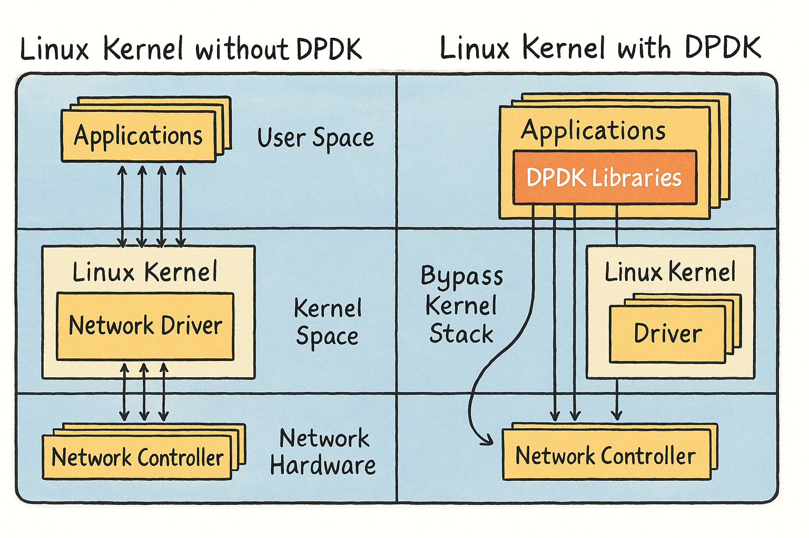
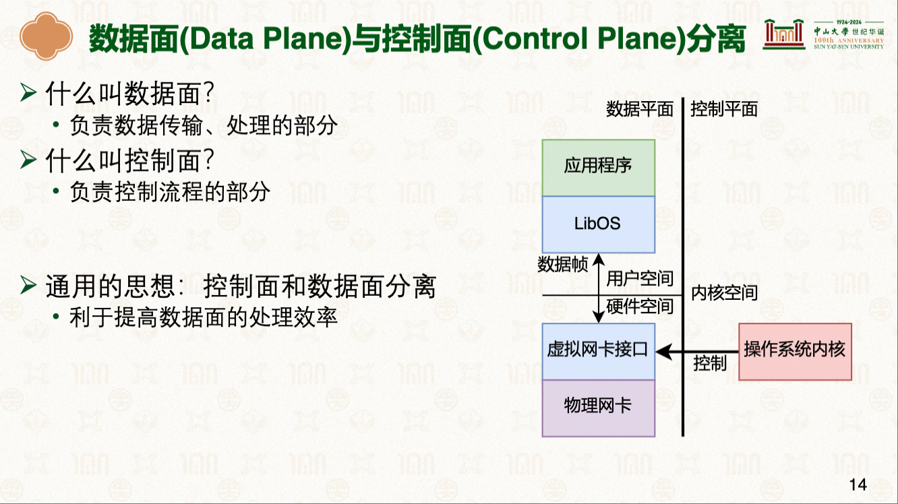

# Intel DPDK <sup>绕过Linux内核协议栈(bypass kernel)·即绕过内核</sup>
> 学习:<br/> [网络协议栈与系统实现](./README.md)<sup>传统Linux网络栈为什么慢。当一个数据包到达网卡时，会触发硬件中断，CPU停下手头的活去处理这个中断。内核的网络协议栈接管后，要做一堆事情：解析协议头、路由查找、防火墙规则检查等等。处理完之后，数据还得从内核空间拷贝到用户空间，应用程序才能拿到</sup> <br/>[26-网络协议栈与系统实现：Intel DPDK [中山大学 操作系统原理]](../000.内存管理/998.REFS/000.中山大学-操作系统/15-0605-network-2.pdf) <br/> [DPDK技术深度解析：AWS上的Kernel Bypass网络优化基础](https://aws.amazon.com/cn/blogs/china/kernel-bypass-network-optimization-basics-on-aws/)<br/> [AWS上的Kernel Bypass网络优化基础](./999.IMGS/AWS上的Kernel%20Bypass网络优化基础.png)(png)

DPDK（Data Plane Development Kit）数据平面开发工具包，是Intel开发的用于网络数据包加速的开发套件。它将传统的网卡收到数据包通过内核态  处理的流程转移到了用户态处理，减少了CPU处理中断和上下文切换的额外开销，能够使CPU得到更高效的利用。<sup>参考:[鲲鹏加速库](./998.REFS/鲲鹏BoostKit%20板载网卡DPDK%20用户指南.pdf)</sup>


## DPDK 示意图
- 

## Why DPDK?
|DPDK产生原因|说明|备注|
|-|-|-|
|网络设备速度越来越快: 100Mbps 1Gbps ... 800G/1.6T(每秒)|- 频繁的硬件中断请求<sup>每来一个包,CPU都至少要处理一次(硬)中断</sup>:  : <br/>- 处理不完: 时刻在处理中断，网速太快，可能1s内也没法处理这么多中断(Linux内核网络协议栈处理也很耗时) <br/>- CPU没时间处理其他任务: 网络产生硬中断会抢占其他软中断或系统调用执行|- 内核网络协议栈的实现无法应对硬件设备的发展<sup>`内核网络协议栈逐渐成为高性能网络的性能瓶颈`</sup>，那应对方案: |
|-|-|-|
|上下文切换|一台电脑存在多个进程，每个进程可能都需要使用网络,进程之前存在调度|-|
|-|-|-|
|内存拷贝|数据从网卡通过DMA方式拷贝到内核缓冲区,再从内核空间拷贝到用户空间|- 每秒需要拷贝1.6T的数据，单台电脑无法实现|
|-|-|-|
|内存管理|- 数据都是存在内存里的，内存访问需要通过MMU（页表访问）|- 对TLB要求高，没有命中则需要四级页表翻译|
|-|-|-|
|局部性失效|数据包的处理可能跨多核，导致CPU缓存失效|- 还可能跨NUMA内存访问，性能影响更大|
|-|-|-|
|-|-|-|

---

## 实现思想： `数据面`和`控制面`分离
|词条|说明|备注|
|-|-|-|
|数据面（Data Plane）|- 数据传输、处理部分|-|
|-|-|-|
|控制面（Control Plane）|- 控制流程的部分|-|
> 具体含义，参考: [26-网络协议栈与系统实现：Intel DPDK [中山大学 操作系统原理]: P12](../000.内存管理/998.REFS/000.中山大学-操作系统/15-0605-network-2.pdf)
```rust

```

### 如何分离?如何提升性能
- 
  + 控制面: 操作系统内核控制网卡驱动，类似 控制收包&发包时机
  + 数据面: 数据解析（网络协议栈的解析）迁移到数据面(用户空间) ，解析好直接交由应用程序使用，不用再复制


---

## 应用
DPDK本身只是2层协议，不提供socket接口 , 如果要用于应用程序，提供socket抽象

|应用场景|说明|备注|
|-|-|-| 
|Nginx如何使用DPDK|- 腾讯云的F-stack (http://f-stack.org/)|-|
|-|-|-|
|-|-|-|
|-|-|-|

---

## 参考资料
- [DPDK技术深度解析：AWS上的Kernel Bypass网络优化基础](https://aws.amazon.com/cn/blogs/china/kernel-bypass-network-optimization-basics-on-aws/)
  + [AWS上的Kernel Bypass网络优化基础](./999.IMGS/AWS上的Kernel%20Bypass网络优化基础.png)
- [https://edc.intel.com/content/www/cn/zh/design/products/ethernet/config-guide-e810-dpdk/dpdk-overview/](https://edc.intel.com/content/www/cn/zh/design/products/ethernet/config-guide-e810-dpdk/dpdk-overview/)
  + [Intel® Ethernet Controller E810 Data Plane Development Kit (DPDK) 22.11/23.03: PDF](./998.REFS/764257_22.11_23.03_E810%20DPDK%20ConfigGuide_764257_rev1_1.pdf)
  + 
- [https://www.dpdk.org/about/#Libraries](https://www.dpdk.org/about/#Libraries)