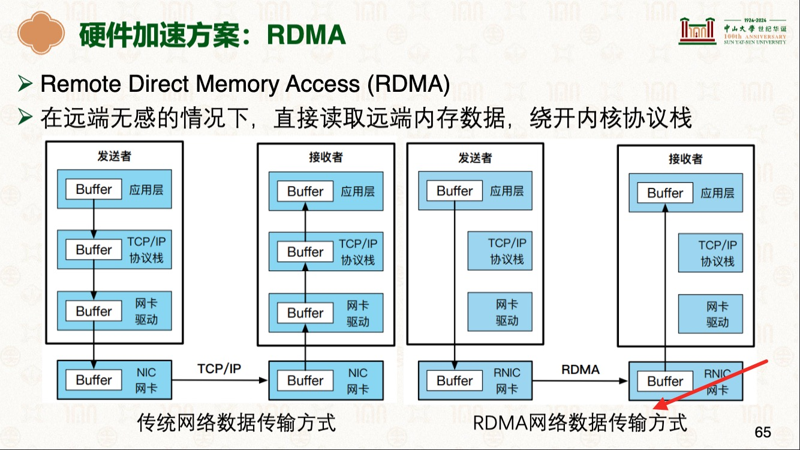

# 硬件加速-RDMA(Remote Direct Memory Access)
> 学习:  [网络协议栈与系统实现](./README.md)传统Linux网络栈为什么慢。当一个数据包到达网卡时，会触发硬件中断，CPU停下手头的活去处理这个中断。内核的网络协议栈接管后，要做一堆事情：解析协议头、路由查找、防火墙规则检查等等。处理完之后，数据还得从内核空间拷贝到用户空间，应用程序才能拿到  [26-网络协议栈与系统实现：Intel DPDK [中山大学 操作系统原理]](../000.内存管理/998.REFS/000.中山大学-操作系统/15-0605-network-2.pdf) 

## RDMA 原理
