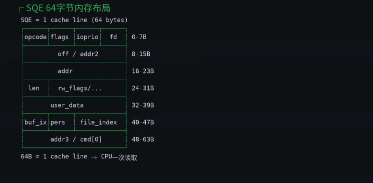
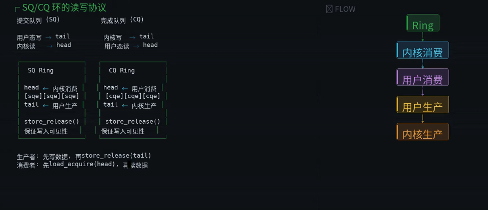
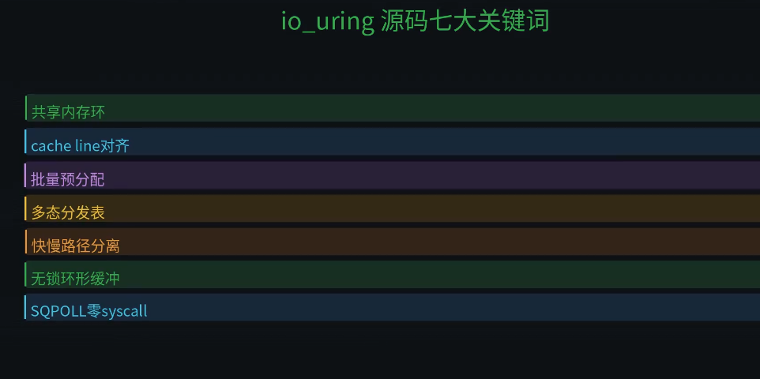

# io_uring

|源码类型|源代码路径|备注|
|-|-|-|
|- 系统调用入口|- 000.LINUX-7.1.3/io_uring/io_uring.c|-|
|-|-|-|
|- 用户API定义|- 000.LINUX-7.1.3/include/uapi/linux/io_uring.h|-|
|-|-|-|
|- 内核内部类型|- 000.LINUX-7.1.3/include/linux/io_uring_types.h|-|
|-|-|-|
|- 操作分发表  |- 000.LINUX-7.1.3/io_uring/opdef.c|-|
|-|-|-|
|- 辅助子系统|- 000.LINUX-7.1.3/io_uring/sqpoll.c | 000.LINUX-7.1.3/io_uring/io-wq.c|-|
|-|-|-|

## 数据结构
### io_uring_sqe 000.LINUX-7.1.3/include/uapi/linux/io_uring.h
- 

### io_uring_cqe 000.LINUX-7.1.3/include/uapi/linux/io_uring.h

## 核心函数
|函数名|定义|文件路径|备注|
|-|-|-|-|
|- io_uring_setup|- SYSCALL_DEFINE2(io_uring_setup, u32, entries, struct io_uring_params __user *, params)...|- 000.LINUX-7.1.3/io_uring/io_uring.c|-|
|-|-|-|-|
|-io_uring_enter|- SYSCALL_DEFINE6(io_uring_enter, unsigned int, fd, u32, to_submit, u32, min_complete, u32, flags, const void __user *, argp, size_t, argsz)...|- 000.LINUX-7.1.3/io_uring/io_uring.c|-io_uring性能的核心秘密:  传统IO：提交&获取结果，两次系统调用 ； io_uring:只需要一次系统调用|
|-|-|-|-|
|-io_submit_sqes|-|-|- 批量提交引擎|
|-|-|-|-|
|- io_issue_sqe|-|-|- io_uring 的多态|
|-|-|-|-|
|- io_uring_register|-|-|-缓存file指针，绕过原子引用计数，提升性能|
|-|-|-|-|

## 零拷贝基石： 共享内存环机制:用户态和内核态共享内存环形缓冲区
> 阅读:[000.LINUX-7.1.3/include/linux/io_uring_types.h]#struct io_rings{....}
- 

---

## 参考资料
- [https://blog.cloudflare.com/missing-manuals-io_uring-worker-pool/](https://blog.cloudflare.com/missing-manuals-io_uring-worker-pool/)
- 
