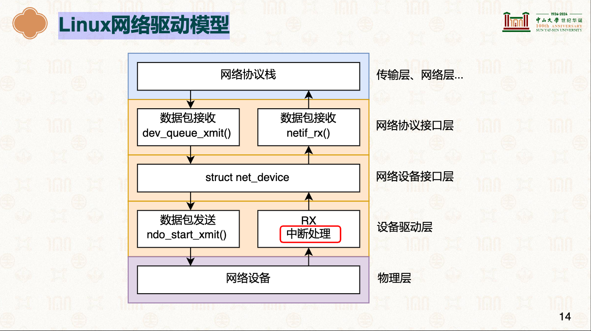
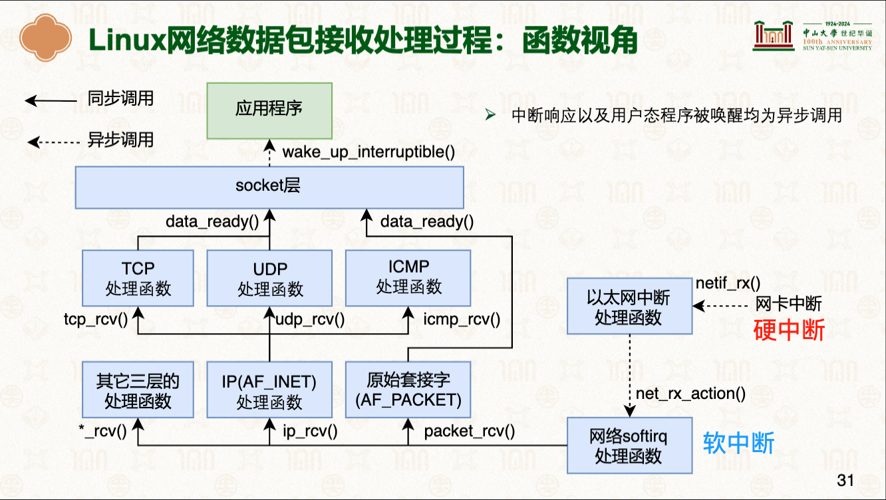
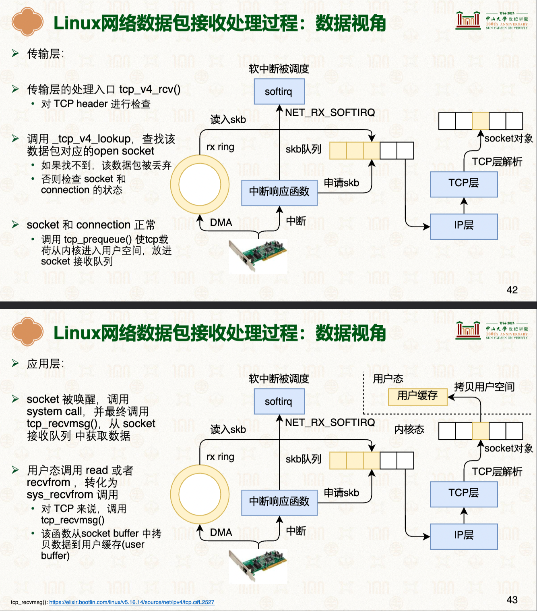

# 网络协议栈与系统实现
> 学习:[25-网络协议栈与系统实现：Linux系统](../000.内存管理/998.REFS/000.中山大学-操作系统/14-0529-network.pdf)

---

## 注意事项`核心
|注意事项|说明|备注|参考|
|-|-|-|-|
|Linux网络驱动模型|-|-|- |
|-|-|-|-|
|Linux 网络数据包接收处理过程: 函数视角|-|-|- |
|-|-|-|-|
|Linux 网络数据包接收处理过程: 数据视角|-|-|- |
|-|-|-|-|

