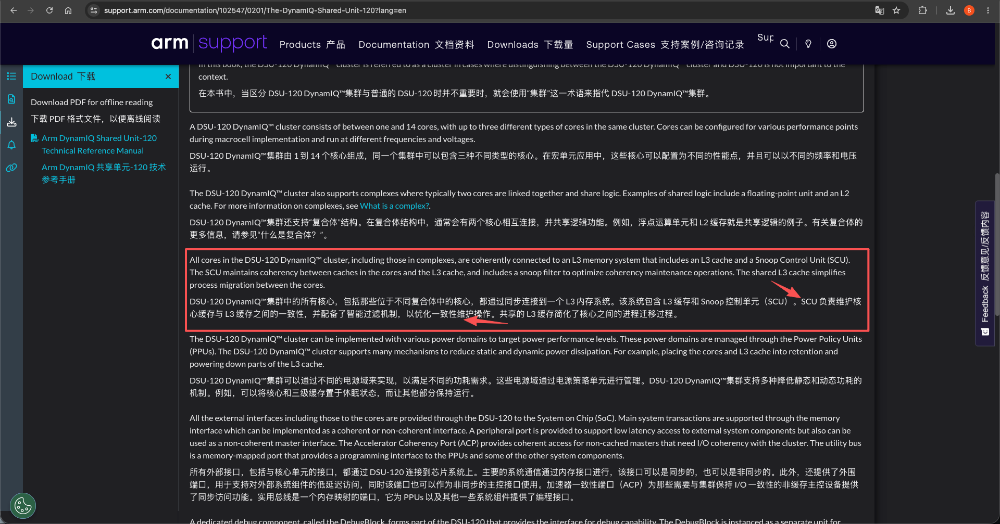
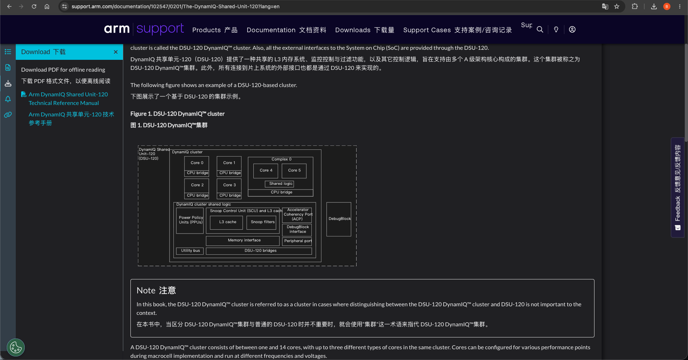
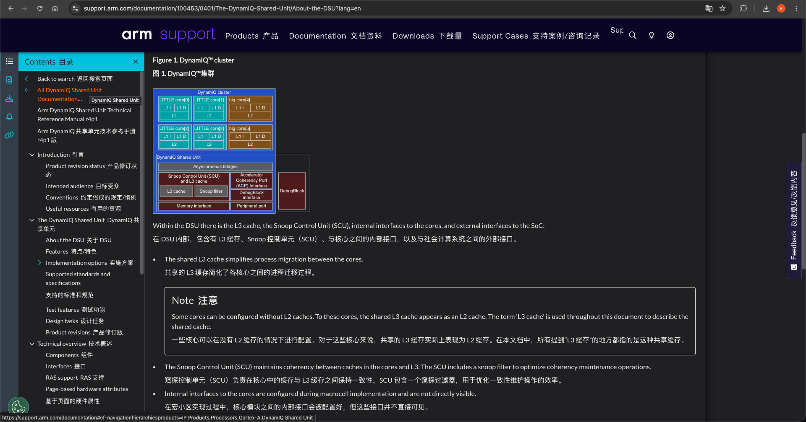
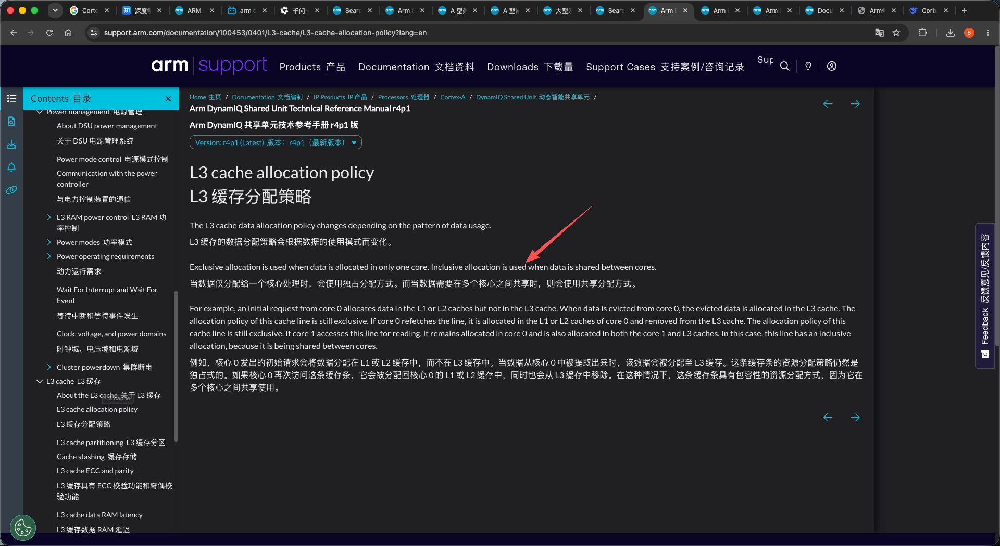

# DynamIQ Shared Unit
DynamIQ 为智能解决方案提供出众的设计灵活性和更强大的计算处理能力，正在推动下一波创新浪潮。它将“大核”CPU 和“小核”CPU 组合成一个完全集成的集群。因此，所有设备（包括可穿戴设备、XR、移动端设备、大屏幕计算设备、汽车和基础设施）在功率和性能方面都将得到提升并获得新的优势。
+ DSU-120（DynamIQ Shared Unit）是 ARM 新一代 CPU 集群的共享单元，它内部已集成部分缓存一致性逻辑（如 L3 缓存管理），但它不负责跨集群、跨设备的缓存一致性。

> 学习参考: <br/>- [Arm® DynamIQ™ Shared Unit-120](../arm_dsu_120_trm_102547_0201_07_en.pdf)<br/>- [Arm® DynamIQ™ Shared Unit Technical Reference Manual](../dsu_trm_100453_0401_05_en.pdf)<br/><br/>

- 多核之间的缓存一致性，由SCU<sup>Snoop Control Unit</sup>（DSU<sup>DynamIQ Shared Unit</sup>）硬件来执行维护，使用MESI协议
  + 
  + 
  + 
  + 
- 多cluster之间的缓存一致性，由 CCI<sup>如 CCI-550</sup>/CMN 来执行维护，没有使用MESI协议

> 与原子指令的关系见 [005.缓存一致性.md](../../001.UNIX-DOCS/003.高速缓存/005.缓存一致性.md)。

---

## 0. 一句话总结

**SCU 是 DynamIQ 集群内的"一致性中枢"：用 snoop filter 当"目录"（避免逐核广播查询）、用缓冲做 cache-to-cache 直接传输（脏数据不落 L3）、用 ACE/CHI 一致性事务与系统互连协作，并用 SYSCOREQ/SYSCOACK 四相握手管理集群进出一致性。** 集群内的原子性（LSE 原子指令）正是建立在"缓存行独占态由一致性协议维护"之上。

> 依据文档：`dsu_trm_100453_0401_05_en.pdf`（DSU，254 页，下称 **DSU TRM**）、`arm_dsu_120_trm_102547_0201_07_en.pdf`（DSU-120，964 页，下称 **DSU-120 TRM**）。文中页码均为 PDF 物理页号。

---

## 1. 为什么需要缓存一致性：多核共享内存

### 1.1 集群结构（DSU 图，DSU TRM §2.1/§3.1，p16-17/p25）

一个 DynamIQ 集群 = 若干核心（最多三类：big / LITTLE / other）+ DSU。DSU 内包含：

- **L3 cache**：所有核心共享，"共享 L3 简化了进程迁移"（p17）。
- **SCU**（Snoop Control Unit）：维护核心缓存与 L3 之间的一致性，含 snoop filter。
- **内部 core 接口**（含 CPU bridge、异步桥）与**外部 SoC 接口**（ACE/CHI master、ACP slave、Peripheral port）。

```
 DynamIQ cluster
 ┌─────────────────────────────────────────────────────┐
 │ DynamIQ Shared Unit (DSU)                            │
 │   core[0]  core[1]  ...  core[N]   ← 各核 L1/L2 cache│
 │     └──────┴─────┬────┘                              │
 │                  │ CPU bridge / 异步桥               │
 │   ┌──────────────┴───────────────────┐               │
 │   │  Snoop Control Unit (SCU)        │               │
 │   │   ├ snoop filter（目录）          │               │
 │   │   ├ L3 cache（共享）              │               │
 │   │   └ cache-to-cache 缓冲          │               │
 │   └──────────────┬───────────────────┘               │
 │                  │ ACE5 / CHI                        │
 └──────────────────┼────────────────────────────────────┘
                    ▼ 系统互连（interconnect）
```

### 1.2 一致性协议：MESI 与 ACE 状态词

- 集群内（SCU 管理）的一致性协议是 **MESI 家族**（Modified/Exclusive/Shared/Invalid）。
- TRM 层面用的状态词是 **Unique/Shared + Clean/Dirty**（DSU TRM 表 7-8 的 `CleanUnique`、`WriteEvict` 里出现 "not in a unique coherence state"、"unique clean lines"，p74），对应关系：

| ACE 状态 | MESI 对应 | 含义 |
| - | - | - |
| UC (UniqueClean) | E | 本行仅一份且干净，独占可写 |
| UD (UniqueDirty) | M | 仅一份且脏，独占可写 |
| SC (SharedClean) | S | 多份且干净，只读 |
| SD (SharedDirty) | O（MOESI） | 多份，本份脏，可响应 snoop 提供数据 |

> 集群外的多 cluster 一致性由 CCI/CMN 维护，**不属于 SCU 职责**（见文首总览）。

---

## 2. SCU 的定位与组成

> "The Snoop Control Unit (SCU) maintains coherency between caches in the cores and L3. The SCU includes a snoop filter to optimize coherency maintenance operations."（DSU TRM §2.1，p17）
>
> "The SCU maintains coherency between all the data caches in the cluster."（DSU TRM §3.1，p26）

- **DSU TRM p26**：SCU 内含缓冲，可处理**核心间的直接 cache-to-cache 传输**，**无需读写 L3**；"Cache line migration 使脏缓存行可以在核心间直接移动"。
- **DSU-120 TRM §3.2，p36**：SCU 维护集群内（可选地）集群外内存系统的一致性；含一组 snoop filter，**每个 cache slice 一个，尺寸按核心数与缓存大小自动确定**。
- L3 的三种实现变体（DSU TRM §3.5，p32；DSU-120 §2.3.2，p27）决定了 SCU 是否在：
  1. **L3 cache present**（默认）—— SCU + snoop filter + L3 全在；
  2. **L3 cache not present** —— SCU 与 snoop filter 在、L3 不在，仍能管理多核一致性；
  3. **Direct connect** —— SCU、snoop filter、L3 **都不在**，仅单核 + 系统缓存，无一致性逻辑。

---

## 3. 核心机制：三个支柱

### 3.1 Snoop filter：目录式过滤，避免广播查询

snoop filter 本质是 SCU 的"**目录**"，记录各核心缓存中已缓存的地址：

- SCU 收到一致请求时**不必逐一查询所有核心缓存**，直接查 snoop filter 判断命中哪个核心（DSU-120 TRM §3.2，p36）。
- **查询优先级**：一致请求**同时命中 L3 tag 与 snoop filter** 时，**L3 优先提供数据**，而非让核心回数据（DSU-120 p36）。
- **性能收益**（DSU TRM §7.5/§8.6，p72/p83）：

| 情况 | 最佳响应延迟 |
| - | - |
| L3 命中（响应+数据） | 10 SCLK |
| L3 miss、命中核心 L1/L2 | 随核心类型变化 |
| snoop filter + L3 tag 均 miss | **6 SCLK**（最快） |
| DVM 响应 | ≥ 6 SCLK |

- snoop filter 存于 **snoop filter RAM**（每个 cache slice 一组，与 tag RAM / victim RAM / data RAM 并列，见图 6-2，DSU TRM p63），同样受 **SECDED ECC 保护**（p57）。
- **ECC 出错**时：snoop filter tag RAM 不可纠错 → 该条目被置无效，但行仍在核心缓存中，DSU 发 `nERRIRQ` 中断通知软件（p58），需要尽快系统复位。

#### 3.1.1 Snoop filter 的逐出与 back-invalidation

snoop filter 是**有容量限制的目录**，它的逐出与"回失效"分三个方向：

**① SCU → 互连：Evict 事务（释放外部目录项）**
- 干净行被逐出集群 → SCU 发 **`Evict`**（CHI）事务（ACE 为 `WriteEvict`/`Evict`，见 DSU TRM 表 7-8/8-7），通知互连中的 snoop filter 释放目录项（p72/p83；DSU-120 p130）。
- `Evict` 是**不带数据**的事务，专用于外部 snoop filter 的目录去分配：*"Evict transactions that do not provide any data, for use in de-allocating a snoop filter"*（DSU TRM §3.4，p31）。
- **例外不产生 Evict**：linefill 取外部 abort、store exclusive 失败、错配别名（p72/p83）。因此互连 snoop filter 必须能处理容量溢出，**必要时向集群发 back-invalidation**。

**② 互连 → SCU：back-invalidation（外部目录回失效）**
- 当互连 snoop filter 容量不足时，向集群发回失效（back-invalidation），使集群内相应行失效以释放目录空间（p72/p83）。

**③ SCU 自身 snoop filter 容量不足：逐出条目 + 让核心行失效**
- 新行要登记而 filter 已满时，SCU 必须**逐出某条记录**，并让持有该行的核心缓存行失效，以保持目录与核心缓存一致。
- DSU-120 用 PMU 计数器直接刻画此机制（DSU-120 §17.2，p229）：

| PMU 事件 | 含义 |
| - | - |
| `SCU_SNP_ACCESS` (0x00C0) | 每个 snoop 请求计数 |
| `SCU_SNP_NO_CPU_SNP` (0x00C2) | *"Counts every external snoop request that completes **without needing to snoop a core**"* —— snoop filter 直接裁决，**无需下探核心**（目录优化生效的度量） |
| `SCU_SNP_EVICT` (0x00C1) | *"Counts every invalidating external snoop request that causes an L3 cache eviction"* |
| `SCU_BACK_INVALIDATE` (0x00F4) | *"Counts when a core must be snooped to invalidate a line because of **not enough capacity in the snoop filter**"* —— 容量不足时 SCU 去 snoop 核心置失效，即 back-invalidation 本义 |
| `SCU_BIB_ACCESS` (0x00F3) | snoop filter 维护活动引起的访问 |
| `SCU_BIB_ECC` (0x00F5) | back-invalidation 访问上的 ECC 错误 |
| `SCU_HZD_ADDRESS` (0x00D0) | 地址冒险（address hazard）引起的 flush |

- **slice 上下电时的批量 back-invalidation**（DSU-120 §5.4.2，p66）：给 L3 cache slice 下电需要 clean+invalidate 该 slice 的 L3 与 snoop filter 内容，*"这反过来需要 clean+invalidate 核心 L1/L2 中对应的行，使它们与 snoop filter 一致（back-invalidation）"*——会消耗时间与动态功耗，但大部分可在后台完成，只是短暂（几千周期量级）会 stall 核心对 L3 的访问。
- **容量不足的后果**（DSU-120 p66）：若 L1/L2 总量超过 snoop filter 容量（如多数核心开启但只用一个 slice），**snoop filter 会限制 L1/L2 的可用大小**——设计仍功能正确，但性能受限。

### 3.2 Cache-to-cache 直接传输：脏数据不必落 L3

- SCU 的缓冲支持**核心 ↔ 核心**的直接传输：脏行被另一核心读取时，数据直接在两个核心的缓存间迁移，**既不用写回 L3、也不用从 L3 读出**（DSU TRM p26；DSU-120 p36）。
- 好处：命中核心缓存时由核心响应 snoop 提供数据，**避免了一次 L3 写回 + 读出的往返**，延迟更低。

#### 3.2.1 Cache-to-cache 传输的时序

TRM 给出的是**端到端最佳延迟**而非逐周期流水图（周期级细节随核心实现变化，见各核心 TRM）：

| 场景 | 最佳延迟 | 出处 |
| - | - | - |
| L3 命中（响应+数据） | 10 SCLK | DSU TRM §7.5/§8.6，p72/p83 |
| L3 miss、命中核心 L1/L2 | 随核心类型变化 | p72 |
| snoop filter + L3 tag 均 miss | 6 SCLK | p72/p83 |
| 命中核心缓存时的持续吞吐 | **约为 L3 带宽的一半左右** | DSU-120 p130 |

cache-to-cache 的概念流程（外部 snoop 命中核心缓存）：

```
系统互连发 snoop（SnpShared / ReadClean …）
   │
   ▼
① SCU 查 snoop filter → 定位行在 core k 的 L1/L2
   │   （snoop filter miss 则直接回 miss，无需下探核心）
   ▼
② SCU 向 core k 发内部 snoop（core 侧查 L1 → L2）
   │
   ▼
③ core k 返回数据（脏行时直接经 SCU 缓冲转发，不落 L3）
   │
   ▼
④ SCU 把数据转发给请求方（另一核心 或 系统互连）
     可并行更新 L3 状态（如 SD→SC）与 snoop filter
```

要点：
- 命中**脏行**时数据直接经 SCU 缓冲转发（cache-to-cache），**无需先写回 L3**（DSU TRM p26；DSU-120 p36）。
- 行若**同时在 L3 与 snoop filter 命中**，**L3 优先供数**（DSU-120 p36）。
- DSU-120 对核心缓存命中的持续速率：*"typically the rate sustained is at least half that for the L3 cache bandwidth"*（p130）。

### 3.3 一致性事务：读写如何被表达

SCU 通过 ACE/CHI 的**事务类型**维护一致性（DSU TRM 表 7-8 p74、表 8-7 p84）：

| 事务类型 | 作用（产生时机） |
| - | - |
| `ReadClean` / `ReadNotSharedDirty` | 装载指令/取指引起的行填充，请求干净或"非共享脏"数据 |
| `ReadUnique` | store 引起的行填充，请求独占所有权 |
| `CleanUnique` | store 命中、但行不在 Unique 状态时，升级独占 |
| `MakeUnique` | 整行 store 且 miss，直接请求独占 |
| `CleanShared` / `CleanSharedPersist` | 缓存维护指令（DC CVAC/CVAP/CVAU） |
| `CleanInvalid` | 缓存维护指令（DC CIVAC 等） |
| `WriteBack` | L1/L2/L3 脏行逐出 |
| `WriteClean` | L3 脏行写回、但行仍留在 L1/L2 |
| `WriteEvict` / `Evict` | unique 干净行逐出 / 干净行逐出（通知外部 snoop filter） |
| `DVM` / `DVMOp` | TLB 与 I-cache 维护指令（分布式虚拟内存广播） |
| `DVM Complete` | 互连下发的 DVM Sync snoop |

集群**不会产生**的事务（DSU TRM p72/p83）：`ReadShared`、`MakeInvalid`、`ReadOnceCleanInvalid`、`ReadOnceMakeInvalid`、`StashOnce*`、`Barriers`（barrier 在集群内终止）等——因为集群内一致性由 snoop filter 保证，不需要向互连请求共享副本。

CHI 上每个请求带 **LPID 字段**标识来源逻辑核（表 8-6，p84）：`[0]`=线程号、`[3:1]`=CPUID、`0x1E`=ACP 请求、`0x1F`=cache copy back。

---

## 4. 两条一致性维护路径

### 4.1 上行：核心发起的访问

1. 核心产生一致请求（如 `ReadClean`）到 SCU；
2. SCU 查 **L3 tag + snoop filter**：
   - snoop filter 表明行在**另一个核心** → 向该核发**内部 snoop**，脏数据经 **cache-to-cache** 返回；
   - 命中 **L3** → L3 提供数据（L3 优先于核心）；
   - 均 miss → 通过 ACE/CHI master 接口**转发到系统互连**；
3. 响应逆序返回，同时更新 snoop filter / L3 分配。

**L3 分配策略配合一致性**（DSU TRM §6.2，p54）：

- 单核独占的行 → **exclusive 分配**（只放 L1/L2，不占 L3）；
- 第二个核心读取共享该行 → 转 **inclusive 分配**（同时分配进 L3），使共享行有公共归属点；
- 从 core 0 逐出的数据 → 分配进 L3；core 0 再取回 → 从 L3 移除回 L1/L2。

### 4.2 下行：外部 snoop 进来

- **接受能力**（DSU TRM §7.5/§8.6）：

| 接口 | Snoop 接受能力 | DVM 接受能力 |
| - | - | - |
| ACE 每个 master | 9 个并发 snoop | - |
| CHI 单 256-bit master | 14 个 | 4 个 |
| CHI 双 256-bit master | 每端口 11 个 | 每端口 4 个 |
| CHI 128-bit master | 11 个 | - |
| DSU-120 | `NUM_LTDBS × NUM_L3_SLICES` | 每 master 端口 4 个（p130） |

  互连**绝不能发送超过接受能力的 DVM 数**，否则系统可能死锁（p82）。
- 外部 snoop 命中集群时，SCU 查 L3 与 snoop filter；L3 命中响应+数据最快 10 SCLK（p72/p83）。
- **DSU-120 双端口 snoop 路由**（图 8-1，p125）：snoop 到达 Port X，计算 `Y = Hash(PA)`，**只有 Y == X 才在集群内查表**，否则直接回 cache miss——互连要么广播（多余的必然 miss），要么用自身 snoop filter 只发到相关端口（推荐）。

### 4.3 CHI 协议下各类 snoop 的响应规则

**接受面**：DSU 接受 CHI 定义的全部 snoop 请求；DSU-120 明确支持 *"all snoop request types listed in the CHI Issue E protocol"*（DSU-120 §8.7，p130）。响应编码（`SnpResp_*` / `SnpRespData_*`）的**权威定义在 AMBA CHI 规范**中，TRM 只明文规定几类行为。以下先给协议通则，再列 TRM 明文。

**协议通则（CHI 规范语义，非 TRM 原文）**：响应分两层——
1. **最终状态**：`SnpResp_I / SC / SD / UC / UD`，表示该 snoop 处理后行在集群内的**一致性终点态**；
2. **是否带数据**：`SnpRespData_*` 前缀表示随响应返回数据。

| snoop 类型 | 协议意图 | 典型响应（行终点态） |
| - | - | - |
| `SnpClean` / `SnpCleanShared` | 取干净数据，行保持 / 降为 Shared | 返回数据，`SnpRespData_SC/SD` 等 |
| `SnpCleanInvalid` | 取干净数据并失效 | `SnpRespData_I` |
| `SnpMakeInvalid` | 失效，不要数据 | `SnpResp_I` |
| `SnpShared` / `SnpNotSharedDirty` | 行变 Shared / 非共享脏 | `SnpResp_SC/SD` 或带数据 |
| `SnpUnique` | 行变 Unique（独占） | `SnpResp_UC/UD` 或带数据 |
| `SnpStashShared/Unique`、`SnpUniqueStash`、`SnpMakeInvalidStash` | 把行带入目标缓存（不改行一致性状态） | 通常 `SnpResp_I`（数据可选） |
| `SnpDvm*`（DVMOp / DVMSync） | 广播虚拟内存维护（TLB / I-cache） | `SnpResp_I`（无物理地址，见 §4.2） |

**TRM 明文规定的响应行为**：

1. **无 L3 时的 stash snoop 响应**（DSU TRM §6.4，p56-57）：
   - `SnpStashShared` / `SnpStashUnique` / `SnpMakeInvalidStash` → 返回 **`SnpResp_I`**（不做 data pull）；
   - `SnpUniqueStash` → 返回 **`SnpRespData_I` 或 `SnpResp_I`**。
2. **SC 状态也能返回数据**（CHI 属性 *"Data return from SC state = Yes"*，DSU TRM §8.3 p80；DSU-120 p126）——行处于 SharedClean 时集群也可作为数据源。
3. **snoop 命中带不可纠错数据错误的行**（DSU TRM §6.5，p59-60）：
   - 数据仍返回（若该 snoop 需要数据）；
   - ACE：额外断言 `nERRIRQ[0]`，但 **snoop 响应不指示错误**；
   - CHI：snoop 响应**指示数据被 poisoned**（互连支持 poisoning 时）或指示有错误。
4. **snoop 命中不可纠错 tag 错误的行** → **按 snoop miss 处理**（行有效性未知，p60）。
5. **无需下探核心的响应**：snoop filter / L3 直接裁决（miss 或 L3 命中），对应 PMU 事件 `SCU_SNP_NO_CPU_SNP`（DSU-120 p229）。

### 4.4 内存类型对一致性逻辑的简化

- Normal **Inner+Outer Write-Back Cacheable** → 缓存进核心数据缓存与 L3；
- 其余 Normal 类型一律按 **Non-cacheable** 处理，直发 master 接口（DSU TRM §7.7，p75）。

---

## 5. 与系统互连的一致性协作

### 5.1 支持外部 snoop filter：Evict 事务

集群对互连中的 snoop filter 提供"目录同步"（DSU TRM p72/p83；DSU-120 p130）：

- 干净行被逐出集群 → SCU 发 **Evict 事务**通知互连释放目录项；
- **例外情况不产生 Evict**：linefill 取外部 abort、store exclusive 失败、错配别名（mismatched aliases）；
- 因此互连 snoop filter **必须处理容量溢出**，必要时对集群发 **back-invalidation（回失效）**。

### 5.2 进出一致性：SYSCOREQ/SYSCOACK 四相握手（DSU TRM §5.9，p52-53）

- **进入**：上电时集群自动断言 `SYSCOREQ` → 互连使能一致性后回 `SYSCOACK` 并开始发 snoop；集群在任一信号有效时都接受 snoop。
- **离开**：下电时集群 deassert `SYSCOREQ`，**先 clean + invalidate L3**，并等互连保证"无更多 snoop、已发 snoop 全部完成"后 deassert `SYSCOACK`。
- 规则：`SYSCOREQ` 只能在 `SYSCOACK` 同电平时跳变；`SYSCOACK` 只能在 `SYSCOREQ` 反相时跳变。

```
t0    t1    t2    t3    t4
SYSCOREQ  ─┐            ┌────
           └────────────┘
SYSCOACK  ────┐      ┌──
              └──────┘
       一致性  连接   使能   断开   禁用
       禁用
```

### 5.3 集群下电自动脱离一致性

收到 OFF 请求后，DSU **自动** clean + invalidate L3 并禁用 snoop，无需软件序列；要求互连支持 SYSCOREQ/SYSCOACK，否则 SoC 负责编程互连移除该集群（p52）。

---

## 6. ACP：外部加速器的一致性入口

ACP 是可选 slave 接口，实现 **ACE5-Lite 子集**（DSU TRM 第 9 章，p88-91；DSU-120 第 10 章）：

- 允许外部非缓存 master 访问可缓存内存；**SCU 检查 ACP 访问在所有缓存位置（L3 + 各核心数据缓存）的分配情况来维护一致性**（p26/p88）。
- 事务受限（表 9-2，p91）：`ReadOnce`、`WriteUniqueFull/Ptl`、`StashOnceShared/Unique` 等；不支持独占访问、barrier、DVM、原子事务（表 9-1，p88）。
- ACP 写默认是**隐式 stash 到 L3**；可用 `AWSTASHLPIDENS` + `AWSTASHLPIDS[3:1]` 定向 stash 到指定核心的 L2（p88/p91）。
- 不满足受限组合的请求 → RRESPS/BRESPS 返回 **SLVERR**（p91）。

---

## 7. DSU-120 相对 DSU 的演进

| 维度 | DSU (100453) | DSU-120 (102547) |
| - | - | - |
| 一致性协议 | ACE5 / CHI Issue B/C/D | CHI Issue E（或 AXI5 非一致），**最多 4 个 master 端口** |
| L3 配置 | 最多 2 slice，最大 4MB，16-way | 最多 **8 slice**，最大 32MB |
| snoop filter | 每 slice 一组 | 一组 snoop filter、每 slice 一个，**尺寸自动确定** |
| 缓存分区 | 私有 partition 方案（CLUSTERPARTCR） | 符合 **MPAM** 架构（MPAMF_*/MPAMCFG_* 寄存器） |
| 集群规模 | 最多 3 类核心，≤13 核 | 最多 **14 核**，支持 **complex**（双核共享 L2/FPU） |
| 电源管理 | P-Channel + CLUSTERPWRCTLR | **PPU（Power Policy Unit）** 自主管理 L3 与核心；slice/way powerdown、Quick Nap |
| 一致性进出 | SYSCOREQ/SYSCOACK | 自动；另有 L3 slice 电源控制 |

两者 SCU 的实现哲学一致：**snoop filter 目录过滤 + cache-to-cache 直接迁移 + ACE/CHI 一致性事务 + 进出一致性握手**；DSU-120 把同一套机制扩展到更大集群、更多 slice 与更深电源管理。

---

## 8. 小结：SCU 实现缓存一致性的完整图景

```
        核心0              核心1             核心2 ...
      L1/L2 cache      L1/L2 cache      L1/L2 cache
           │  ▲              │  ▲               │  ▲
           │  │ 内部 snoop / cache-to-cache     │  │
           ▼  │              ▼  │               ▼  │
      ┌──────────────────────────────────────────────────┐
      │                  SCU (Snoop Control Unit)         │
      │   ┌────────────────────────────────────────────┐  │
      │   │  snoop filter（目录，跟踪各核缓存地址）      │  │
      │   └────────────────────────────────────────────┘  │
      │   ┌────────────────────────────────────────────┐  │
      │   │  L3 cache（共享，exclusive/inclusive 分配）  │  │
      │   └────────────────────────────────────────────┘  │
      │   缓冲：cache-to-cache 直接传输、snoop 队列、DVM   │
      └───────────────────┬────────────────────────────────┘
                          │ ACE5 / CHI (SYSCOREQ/SYSCOACK)
              ┌───────────┴──────────┐
              │   系统互连 (interconnect) │←─ 外部 snoop / ACP / 外部 snoop filter
              └──────────────────────┘
```

1. **写独占**：store 触发 `ReadUnique`/`MakeUnique`，确保独占所有权；
2. **共享读取**：`ReadClean` 经 snoop filter 定位持有者，脏数据 cache-to-cache 直传，干净数据由 L3 提供；
3. **逐出/维护**：`WriteBack`/`WriteClean`/`Evict` 回写并同步外部 snoop filter；
4. **广播维护**：DVM 广播 TLB/I-cache 维护指令；
5. **系统进出**：SYSCOREQ/SYSCOACK 四相握手实现集群与互连一致性的挂接/脱离。

---

## 附录 A：ACE 与 CHI

### A.1 两者是什么

ACE 和 CHI 是 DSU 连接外部系统的**两条可选"对外一致总线"**。它们承载的正是"集群内一致性（SCU 管）↔ 系统一致性（互连管）"之间的所有一致事务——集群内一致性由 SCU 维护，**ACE/CHI 则是集群与系统其他 master 之间的一致关口**。

| | ACE（AXI Coherency Extensions） | CHI（Coherent Hub Interface） |
| - | - | - |
| 本质 | 基于**信号线**的总线式一致协议 | 基于**报文包（flit）**的可扩展一致协议 |
| 版本 | ACE5（Issue F.b，DSU TRM p22） | Issue B/C/D（DSU p22/p79）；DSU-120 用 Issue E（p19） |
| 典型互连 | CCI-550 这类点对点一致互连 | CMN-600 这类 mesh 网格互连（p18/p32/p79） |
| 传输形态 | 通道 + 突发（burst） | 通道 + 报文（packet/flit） |

- **ACE**：在 AXI 基础上扩展出 **snoop 通道**，让互连能"看进"连接方（DSU）的缓存；一致性事务类型（`ReadClean`/`ReadUnique`…）、共享域（`ARDOMAIN`）、`RACK/WACK` 等。
- **CHI**：事务封装成报文在 REQ/DAT/RSP/SNP 通道上传输；DSU 作为**带缓存的请求端**（CHI 术语 **RN-F**<sup>Request Node with cache</sup>，协议术语非 TRM 原文），互连侧有 **HN-F**<sup>Home Node with cache</sup>（TRM p84）、SN 等角色。

### A.2 通道与传输形态

**ACE 的 snoop 通道**（DSU TRM §7.5，p68/p72 明确 AC/CR）：

| 通道 | 方向 | 作用 |
| - | - | - |
| **AC** | 互连 → DSU | snoop 地址通道（互连对 DSU 发 snoop 请求） |
| **CD**<sup>ACE 协议术语</sup> | DSU → 互连 | snoop 数据通道（返回 snoop 命中的数据） |
| **CR** | DSU → 互连 | snoop 响应通道 |

> DSU TRM 用 AC/CR 定义 snoop 接受能力："从请求在 AC 通道被接受、到响应在 CR 通道被接受"（p72）。CD 为 ACE 协议标准通道，TRM 未逐字命名。

**CHI 的 flit 通道**（DSU TRM §8.6，p82-83 等）：

| 通道 | 方向 | 作用 |
| - | - | - |
| **TXREQ** | DSU → 互连 | 一致请求 / 缓存维护 / DVM 报文 |
| **TXDAT** | DSU → 互连 | 写数据 / 响应数据 |
| **TXRSP** | DSU → 互连 | 读响应（含 DataSource 字段） |
| **RXSNP** | 互连 → DSU | snoop 请求（含 stash、DVM） |
| **RXDAT** | 互连 → DSU | 读返回数据 |
| **RXRSP** | 互连 → DSU | 写响应 |

### A.3 在一致性过程中的功能（三个角色）

```
        ┌───────────── DSU 集群 ─────────────┐
        │  SCU（管集群内部一致性）             │
        │  snoop filter + L3 + 核心缓存       │
        └──────┬────────────────────────────┘
               │  ACE5  ──┐         ┌── CHI
               ▼          ▼         ▼
          CCI-550     （二选一）   CMN-600 mesh
        （点对点总线）            （报文可扩展）
```

1. **向外发一致请求**：SCU 需要向系统请求数据/所有权时，经 ACE/CHI 发行填充（`ReadClean`/`ReadUnique`）、逐出（`WriteBack`/`WriteClean`/`Evict`）、缓存维护（`CleanShared`/`CleanInvalid`）、DVM——使集群内缓存的行对外部"可见、可维护"。
2. **向内接 snoop**：其他 master 访问共享内存时互连 snoop 集群——**ACE 走 AC/CD/CR 三通道，CHI 走 RXSNP 报文**；SCU 查 L3 + snoop filter + 核心缓存后响应（见 §4.2/§4.3）。
3. **承载进出一致性握手**：`SYSCOREQ`/`SYSCOACK` 四相握手在这两条 master 接口上运行（CHI master 0 / ACE master 0/1 各有后缀，p53），集群上下电借此挂接/脱离系统一致性（见 §5.2）。

### A.4 关键差异（文档数据）

| 维度 | ACE5 | CHI |
| - | - | - |
| 传输形态 | 信号线 + 突发 | 报文包（flit） |
| 互连示例 | CCI-550（点对点总线） | CMN-600（mesh，p18/p32/p79） |
| DSU 配置 | 1×128bit 或 2×128bit master（p18） | 1×128/256bit，或 2×256bit（p18）；DSU-120 最多 **4** 个（p19） |
| 一致性角色 | 一致 master | 请求端 RN-F；互连 HN-F（p84） |
| snoop 通道 | AC / CD / CR | RXSNP 报文 |
| snoop 接受能力 | 每 master **9** 个（p72） | 单 256-bit **14** 个 / 双各 **11** 个（p82） |
| DVM 接受能力 | - | **4** 个（p82） |
| 特有能力 | AXI 兼容模式、barrier 集群内终止（p76） | stashing、DMT、DataSource、LPID、原子事务（表 8-1 p79-80） |
| 适用场景 | 小规模、低延迟 | 大规模、高带宽、可扩展 |

### A.5 相关接口关系

- **ACP 是 ACE5-Lite 子集**（p88）：它是把"一致 slave"接进集群的接口，与这里的 master 接口相对。
- **Direct connect 模式必须用 CHI**（单 256-bit，p32）：该模式无 SCU/snoop filter/L3，一致性完全交给互连系统缓存。
- **AXI 兼容模式**（p76-77）：ACE 接口可降级为纯 AXI，此时无一致性（`BROADCAST*` 输入置 LOW，snoop 通道拉低）。

---

## 附录 B：页码索引

| 内容 | 章节 | DSU TRM (100453) | DSU-120 TRM (102547) |
| - | - | - | - |
| ACE/CHI 协议版本 | §2.2 / §8.2 | p22 / p79 | p19 |
| ACE snoop 通道（AC/CR） | §7.5 | p68 / p72 | - |
| CHI flit 通道（TXREQ/RXSNP/TXDAT/RXDAT） | §8.6 | p79-83 | p128-129 |
| ACE/CHI 配置（master 宽度/数目） | §2.3 | p18 | p19 |
| CHI HN-F 角色 | §8.7 | p84 | p131 |
| CMN-600 互连 | §2.3 / §3.5 | p18 / p32 / p79 | - |
| SCU 定位与 snoop filter | §2.1 / §3.1 | p17 / p26 | p18 / p36 |
| L3 内存系统三种变体 | §3.5 / §2.3.2 | p32 | p27 |
| L3 分配策略（exclusive/inclusive） | §6.2 | p54 | p108 |
| cache stashing | §6.4 | p56 | p114 |
| cache slice 与 snoop filter RAM | §6.7 | p62-63 | p117-118 |
| snoop 接受能力 / 延迟 | §7.5 / §8.6 | p72 / p82-83 | p130 |
| ACE 事务类型 | §7.6 | p73-74 | - |
| CHI 事务类型 / LPID | §8.7 | p84 | p131 |
| 外部 snoop 路由（双端口 Hash） | - | p78 | p125 |
| Evict 事务 / 外部 snoop filter | §7.5 / §8.6 | p72 / p83 | p130 |
| snoop filter 逐出 / back-invalidation | §6.4 / §5.4.2 / PMU | p72 / p83 | p66 / p229 |
| stash snoop 响应（无 L3） | §6.4 | p56-57 | - |
| 核心缓存 snoop 吞吐（≈L3 带宽一半） | §8.6 | - | p130 |
| CHI snoop 支持范围 / SC 态返数 | §8.6 / §8.3 | p80 | p126 / p130 |
| SYSCOREQ/SYSCOACK 四相握手 | §5.9.1 | p52-53 | - |
| ACP 一致性维护 | §9 | p88-91 | p147-156 |
| 集群上下电自动进出一致性 | §5.9 | p52 | - |
| DSU-120 特性总览 | §2 | - | p17-19 |

---

## 参考资料
- [DynamIQ Shared Unit](https://www.arm.com/zh-cn/technologies/dynamiq)
- [Arm® DynamIQ™ Shared Unit-120](../arm_dsu_120_trm_102547_0201_07_en.pdf)
- [Arm® DynamIQ™ Shared Unit Technical Reference Manual](../dsu_trm_100453_0401_05_en.pdf)
