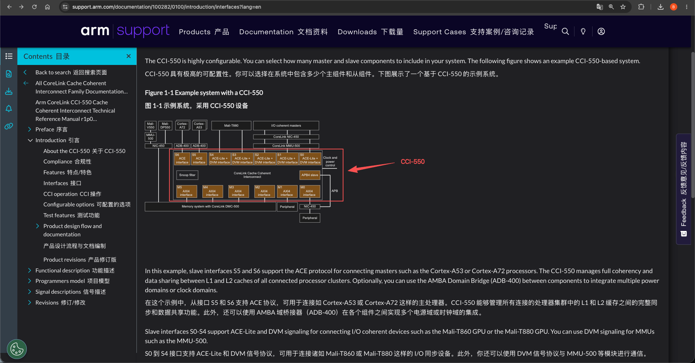
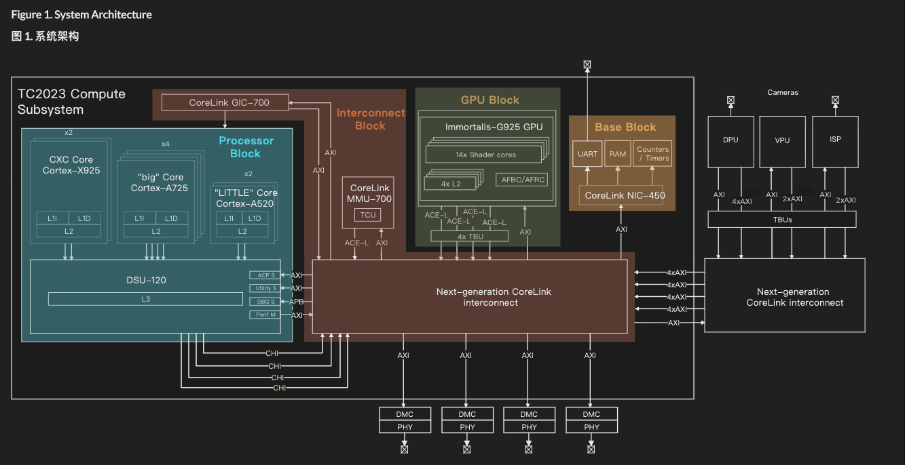

# CCI-550 （Cache Coherent Interconnect ：缓存一致性互联）
ARM CoreLink CCI-550 缓存一致性互连架构:  通过硬件互连总线实现 CPU 集群、GPU、I/O 设备与内存系统之间的全缓存一致性(实现整个 SoC 级别缓存一致性的“总指挥”)。CCI-550 的核心职责是为 big.LITTLE 架构中的 CPU 集群（如 Cortex-A72/A53）、Mali GPU、视频/显示处理器等提供硬件级缓存一致性
- 
   + Mail : IO 设备
   + CoreLink Cache Coherent Interconnect: 缓存一致性互联

- 
   + [Arm Total Compute 2023 Reference Design Software Developer Guide](https://support.arm.com/documentation/109577/0100/System-architecture?lang=en)
   + [Arm Total Compute 2023 Reference Design Software Developer Guide#PDF](../../007.BOOKs/arm_total_compute_2023_reference_design_software_developer_guide_109577_1.0_01_en.pdf)
   + Next-generation CoreLink interconnect: CCI-550 的功能体现