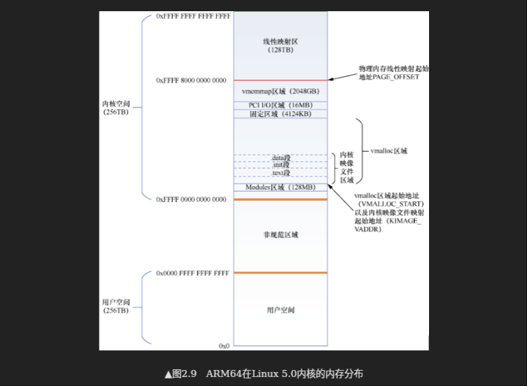

# 编译<sup>宏观</sup>(编译<sup>微观</sup>、汇编、链接)
> 阅读:[计算机组成与设计#2.12 翻译并启动程序](../../007.BOOKs/计算机组成与设计-硬件-软件_接口/计算机组成与设计-pages-1.pdf)

## 编译流程<sup>从资料中总结</sup>
C语言程序(.c) --**(编译器)**--> 汇编语言程序(.S) --**(汇编器)**--> 目标文件(.o) --**(链接器)<sub>以及库例程(.a 、.so) ，核心文件: 链接脚本文件</sub>**--> 可执行文件(.out)<sub>引用全部解析，部分地址可能未解析(库例程)，由加载器去处理</sub>

### 目标文件格式

- 上图只包含”目标文件格式“的部分内容: .data<sub>数据段，用于存放已初始化的全局变量和静态变量</sub> 、.init<sub>存储初始化代码，在程序启动时自动执行</sub> 、.text<sub>代码段，用于存放程序的可执行指令</sub> , 其他段:.bss<sub>存储未初始化的全局/静态变量（实际不占用磁盘空间，运行时初始化为0）</sub>、.rodata<sub>存储只读数据（如字符串常量）</sub>、.plt/.got<sub>用于动态链接（共享库）</sub>

UNIX 系统中的目标文件通常包含以下六个不同的部分：
- 目标文件头，描述目标文件其他部分的大小和位置。
- 代码段，包含机器语言代码。
- 静态数据段，包含在程序生命周期内分配的数据 。 (UNIX 系统允许程序使用存在于整个程序中的静态数据，也允许随程序的需要而增长或减少的动态数据 。 见图 2-14。 )
- 重定位信息，标记了一些在程序加载进内存时依赖于绝对地址的指令和数据 。
- 符号表，包含剩余未定义的标签，如外部引用 。
- 调试信息，包含一份简明描述，说明模块如何编译，以便调试器能够将机器指令关联到 C 源文件，并使数据结构也变得可读 


而链接器的的任务，就是将多个目标文件(.o)进行缝合，最终生成计算机上的可执行文件。

#### 查看每个段大小
```shell
wei@Berries:~/OPEN_SOURCE/Berries-Kernel/000.SOURCE_CODE/000.LINUX-5.9/000.LINUX-5.9$ /home/wei/apps/001.Arm-ToolChain/arm-gnu-toolchain-14.3.rel1-x86_64-aarch64-none-linux-gnu/bin/aarch64-none-linux-gnu-size vmlinux
   text    data     bss     dec     hex filename
20209817        11309098         492356 32011271        1e87407 vmlinux
```

### 流程简介
主要是**汇编器**和**链接器**对 内/外部引用的解析<sub>将引用解析为真实地址</sub>,包含代码运行的起始地址<sub>链接器核心文件(可能还有其他): 链接脚本文件，如 arch/arm64/kernel/vmlinux.lds.S</sub>，详细内容学习:[编译、汇编、链接过程概述](./999.REF_DOCS/000.编译、汇编、链接过程概述/)
